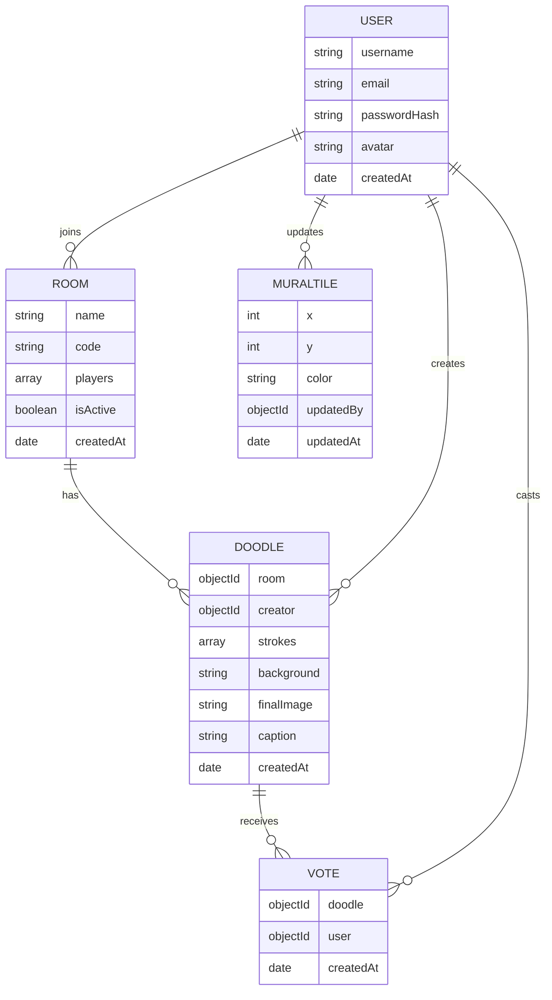

```mermaid
erDiagram
    USER {
        string username
        string email
        string passwordHash
        string avatar
        date createdAt
    }
    ROOM {
        string name
        string code
        array players
        boolean isActive
        date createdAt
    }
    DOODLE {
        objectId room
        objectId creator
        array strokes
        string background
        string finalImage
        string caption
        date createdAt
    }
    VOTE {
        objectId doodle
        objectId user
        date createdAt
    }
    MURALTILE {
        int x
        int y
        string color
        objectId updatedBy
        date updatedAt
    }

    USER ||--o{ ROOM : "joins"
    ROOM ||--o{ DOODLE : "has"
    USER ||--o{ DOODLE : "creates"
    DOODLE ||--o{ VOTE : "receives"
    USER ||--o{ VOTE : "casts"
    USER ||--o{ MURALTILE : "updates"
```