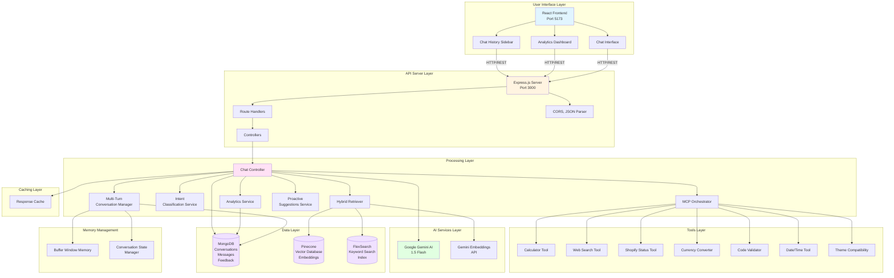
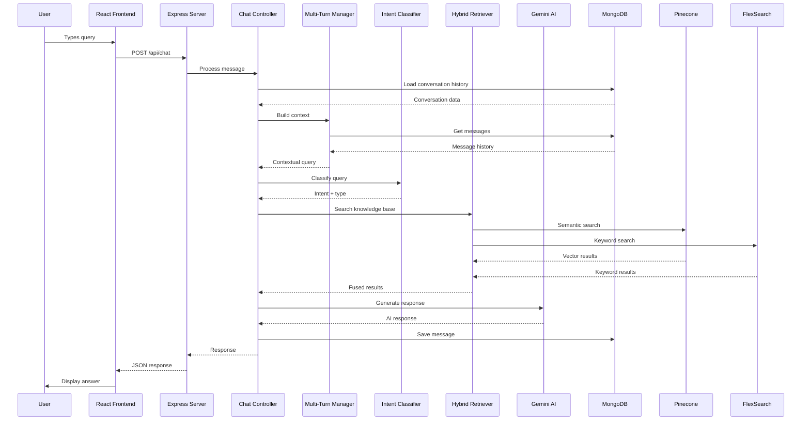
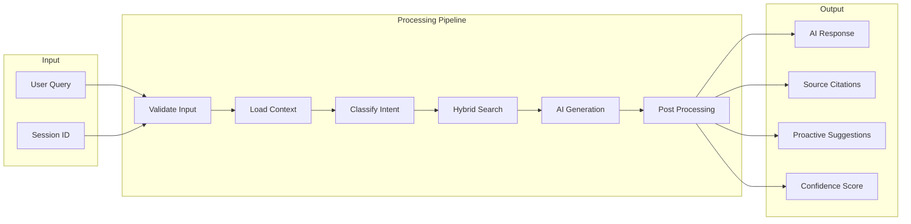
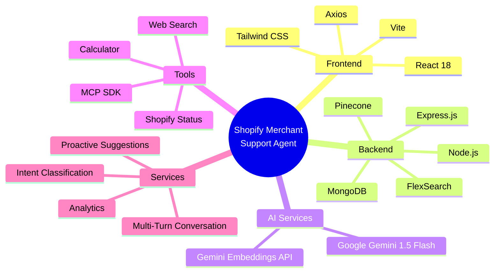

# 🏗️ Shopify Merchant Support Agent - High-Level Architecture

## System Architecture Diagram

```mermaid
graph TB
    subgraph "User Interface Layer"
        UI[React Frontend<br/>Port 5173]
        ChatUI[Chat Interface]
        AnalyticsUI[Analytics Dashboard]
        HistoryUI[Chat History Sidebar]

        UI --> ChatUI
        UI --> AnalyticsUI
        UI --> HistoryUI
    end

    subgraph "API Server Layer"
        Express[Express.js Server<br/>Port 3000]
        Routes[Route Handlers]
        Middleware[CORS, JSON Parser]
        Controllers[Controllers]

        Express --> Routes
        Express --> Middleware
        Routes --> Controllers
    end

    subgraph "Processing Layer"
        ChatCtrl[Chat Controller]
        MultiTurn[Multi-Turn<br/>Conversation Manager]
        IntentClassifier[Intent<br/>Classification Service]
        HybridRet[Hybrid Retriever]
        MCPSvc[MCP Orchestrator]
        ProactiveSvc[Proactive<br/>Suggestions Service]
        AnalyticsSvc[Analytics Service]

        ChatCtrl --> MultiTurn
        ChatCtrl --> IntentClassifier
        ChatCtrl --> HybridRet
        ChatCtrl --> MCPSvc
        ChatCtrl --> ProactiveSvc
        ChatCtrl --> AnalyticsSvc
    end

    subgraph "AI Services Layer"
        GeminiAI[Google Gemini AI<br/>1.5 Flash]
        Embeddings[Gemini Embeddings<br/>API]

        HybridRet --> Embeddings
        ChatCtrl --> GeminiAI
    end

    subgraph "Tools Layer"
        Calculator[Calculator Tool]
        WebSearch[Web Search Tool]
        ShopifyStatus[Shopify Status Tool]
        CurrencyConv[Currency Converter]
        CodeValidator[Code Validator]
        DateTime[Date/Time Tool]
        ThemeCompat[Theme Compatibility]

        MCPSvc --> Calculator
        MCPSvc --> WebSearch
        MCPSvc --> ShopifyStatus
        MCPSvc --> CurrencyConv
        MCPSvc --> CodeValidator
        MCPSvc --> DateTime
        MCPSvc --> ThemeCompat
    end

    subgraph "Data Layer"
        MongoDB[(MongoDB<br/>Conversations<br/>Messages<br/>Feedback)]
        Pinecone[(Pinecone<br/>Vector Database<br/>Embeddings)]
        FlexSearch[(FlexSearch<br/>Keyword Search<br/>Index)]

        MultiTurn --> MongoDB
        HybridRet --> Pinecone
        HybridRet --> FlexSearch
        AnalyticsSvc --> MongoDB
        ChatCtrl --> MongoDB
    end

    subgraph "Memory Management"
        BufferMem[Buffer Window Memory]
        ConvState[Conversation State<br/>Manager]

        MultiTurn --> BufferMem
        MultiTurn --> ConvState
    end

    subgraph "Caching Layer"
        ResponseCache[Response Cache]
        ChatCtrl --> ResponseCache
    end

    %% Connections between layers
    ChatUI -->|HTTP/REST| Express
    AnalyticsUI -->|HTTP/REST| Express
    HistoryUI -->|HTTP/REST| Express

    Controllers --> ChatCtrl

    style UI fill:#e1f5ff
    style Express fill:#fff4e1
    style ChatCtrl fill:#ffe1f5
    style GeminiAI fill:#e1ffe1
    style MongoDB fill:#f0e1ff
    style Pinecone fill:#f0e1ff
    style FlexSearch fill:#f0e1ff
```

## Component Interaction Flow

```mermaid
sequenceDiagram
    participant User
    participant Frontend as React Frontend
    participant Express as Express Server
    participant Controller as Chat Controller
    participant MultiTurn as Multi-Turn Manager
    participant Intent as Intent Classifier
    participant Retriever as Hybrid Retriever
    participant Gemini as Gemini AI
    participant MongoDB
    participant Pinecone
    participant FlexSearch

    User->>Frontend: Types query
    Frontend->>Express: POST /api/chat
    Express->>Controller: Process message

    Controller->>MongoDB: Load conversation history
    MongoDB-->>Controller: Conversation data

    Controller->>MultiTurn: Build context
    MultiTurn->>MongoDB: Get messages
    MongoDB-->>MultiTurn: Message history
    MultiTurn-->>Controller: Contextual query

    Controller->>Intent: Classify query
    Intent-->>Controller: Intent + type

    Controller->>Retriever: Search knowledge base
    Retriever->>Pinecone: Semantic search
    Retriever->>FlexSearch: Keyword search
    Pinecone-->>Retriever: Vector results
    FlexSearch-->>Retriever: Keyword results
    Retriever-->>Controller: Fused results

    Controller->>Gemini: Generate response
    Gemini-->>Controller: AI response

    Controller->>MongoDB: Save message
    Controller-->>Express: Response
    Express-->>Frontend: JSON response
    Frontend->>User: Display answer
```

## Data Flow Architecture

```mermaid
flowchart LR
    subgraph "Input"
        UserQuery[User Query]
        SessionId[Session ID]
    end

    subgraph "Processing Pipeline"
        Validation[Validate Input]
        ContextLoad[Load Context]
        IntentClass[Classify Intent]
        HybridSearch[Hybrid Search]
        AIGen[AI Generation]
        PostProcess[Post Processing]
    end

    subgraph "Output"
        Response[AI Response]
        Sources[Source Citations]
        Suggestions[Proactive Suggestions]
        Confidence[Confidence Score]
    end

    UserQuery --> Validation
    SessionId --> Validation
    Validation --> ContextLoad
    ContextLoad --> IntentClass
    IntentClass --> HybridSearch
    HybridSearch --> AIGen
    AIGen --> PostProcess
    PostProcess --> Response
    PostProcess --> Sources
    PostProcess --> Suggestions
    PostProcess --> Confidence
```

## Technology Stack Visualization

```mermaid
mindmap
  root((Shopify Merchant<br/>Support Agent))
    Frontend
      React 18
      Vite
      Tailwind CSS
      Axios
    Backend
      Node.js
      Express.js
      MongoDB
      Pinecone
      FlexSearch
    AI Services
      Google Gemini 1.5 Flash
      Gemini Embeddings API
    Tools
      MCP SDK
      Calculator
      Web Search
      Shopify Status
    Services
      Intent Classification
      Proactive Suggestions
      Analytics
      Multi-Turn Conversation
```

