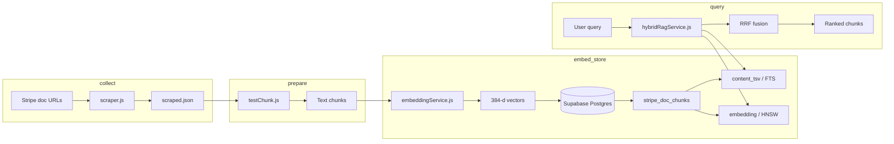
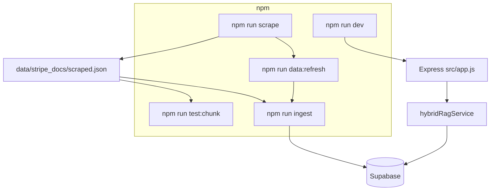
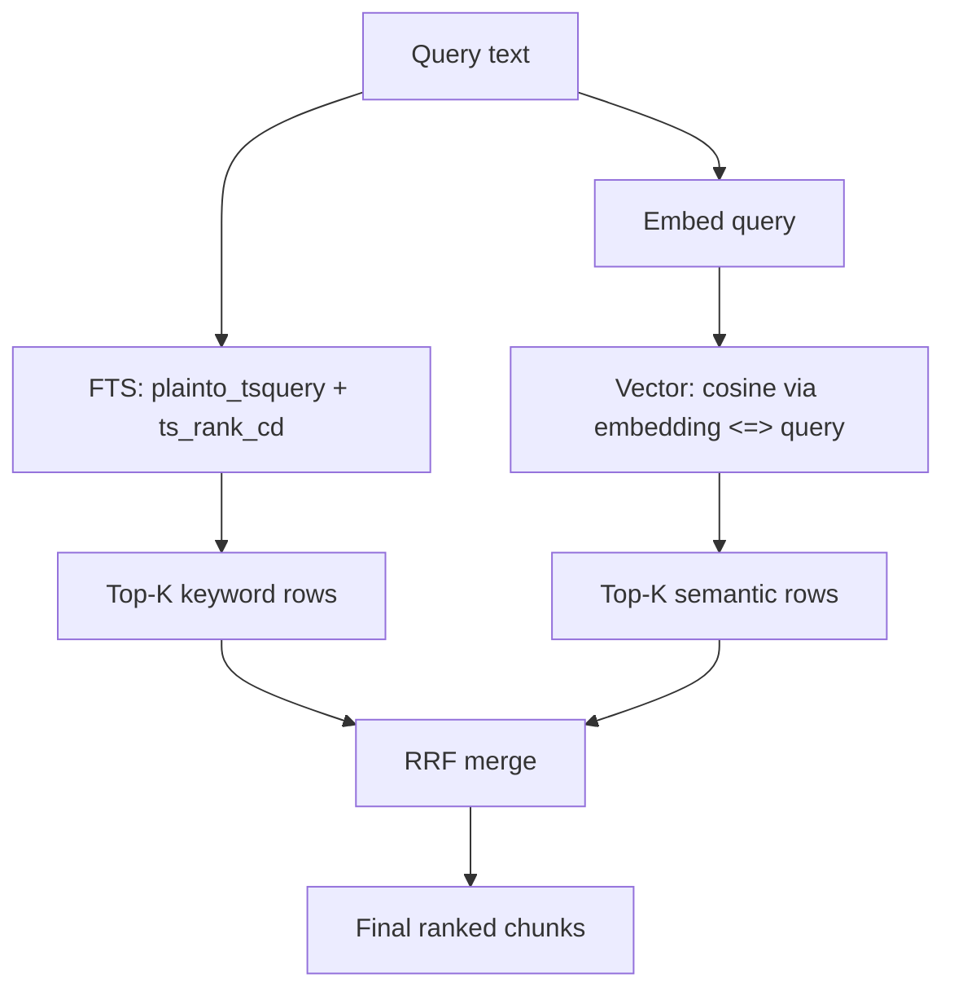

# StripeBot — Backend

Hybrid RAG backend: scrape Stripe docs → chunk → embed → **Supabase (Postgres + pgvector)** → keyword + semantic search with fusion.

For **why this exists**, scope, and trade-offs, see **[PROJECT.md](./PROJECT.md)**.

---

## Pipeline overview



### Commands vs flow



### Hybrid retrieval (keyword + semantic)



---

## Quick start

1. **Install**

   ```bash
   cd PBL4/StripeBot/backend
   npm install
   ```

2. **Configure** — copy `.env.example` if you maintain one, or set:

   - `DATABASE_URL` *or* `PGHOST`, `PGPORT`, `PGDATABASE`, `PGUSER`, `PGPASSWORD`
   - Optional scrape tuning: `RATE_LIMIT_DELAY`, `SCRAPE_FETCH_TIMEOUT_MS`, `SCRAPE_USER_AGENT`

3. **Database** — in Supabase **SQL Editor**, run:

   [`src/sql/setup_hybrid.sql`](./src/sql/setup_hybrid.sql)

   This creates `stripe_doc_chunks` (vectors + generated `tsvector` + indexes).

4. **Scrape → ingest → run API**

   ```bash
   npm run scrape
   npm run test:chunk    # optional sanity check
   npm run ingest        # first run downloads the embedding model (slow)
   npm run dev
   ```

   Or one shot (scrape + ingest, not the server):

   ```bash
   npm run data:refresh
   ```

---

## NPM scripts

| Script | Purpose |
|--------|---------|
| `npm run scrape` | Fetch listed Stripe URLs → `data/stripe_docs/scraped.json` |
| `npm run test:chunk` | Read `scraped.json`, print chunk count (validates `testChunk.js`) |
| `npm run ingest` | Chunk → embed → upsert `stripe_doc_chunks` |
| `npm run data:refresh` | `scrape` then `ingest` |
| `npm run dev` | Express API (nodemon) |
| `npm start` | Express API (no watch) |

**Note:** `dev` does **not** auto-scrape or auto-ingest on boot (avoids accidental full re-runs).

---

## API

| Method | Path | Body / notes |
|--------|------|----------------|
| `GET` | `/health` | DB connectivity check |
| `POST` | `/api/rag/search` | `{ "query": "string", "keywordLimit"?, "semanticLimit"?, "finalLimit"? }` |

Example:

```bash
curl -s -X POST http://localhost:3000/api/rag/search \
  -H "Content-Type: application/json" \
  -d '{"query":"webhook signature","finalLimit":5}'
```

Default port: `3000` (override with `PORT`).

---

## Key files

| Path | Role |
|------|------|
| `src/scripts/scraper.js` | HTTP fetch + Cheerio → `scraped.json` |
| `src/scripts/testChunk.js` | Chunking (swap-friendly for teammate) |
| `src/scripts/ingestVectors.js` | JSON → chunks → embeddings → DB |
| `src/services/embeddingService.js` | `Xenova/all-MiniLM-L6-v2` (384-d) |
| `src/services/hybridRagService.js` | FTS + vector search + RRF |
| `src/config/db.js` | `pg` pool + `pgvector` registration |
| `src/app.js` | Express entry |
| `src/sql/setup_hybrid.sql` | Schema for hybrid RAG |

Legacy: `src/sql/setup.sql` targets an older `stripe_docs` table; **hybrid flow uses `setup_hybrid.sql` only**.

---

## Ingest behavior

- Default: **truncates** `stripe_doc_chunks` before load. Set `INGEST_APPEND=1` to skip truncate (upsert only).
- Chunk size / overlap: `CHUNK_MAX_CHARS`, `CHUNK_OVERLAP` (see `testChunk.js`).

---

## Troubleshooting

| Symptom | Likely cause |
|---------|----------------|
| `relation "stripe_doc_chunks" does not exist` | Run `setup_hybrid.sql` on the **same** DB as `.env`. |
| `Headers is not defined` (transformers) | Should be mitigated via undici polyfill in `embeddingService.js`; use Node 18+ if issues persist. |
| Empty keyword hits | Query terms are stopwords or not in indexed text; try different phrasing. |
| Scrape flags ignored with npm | Use `npm run scrape -- --sources=api --limit=1` (note `--` before script args). |

---

## Related doc

- **[PROJECT.md](./PROJECT.md)** — product context, importance, scope, risks, and maintenance notes.
