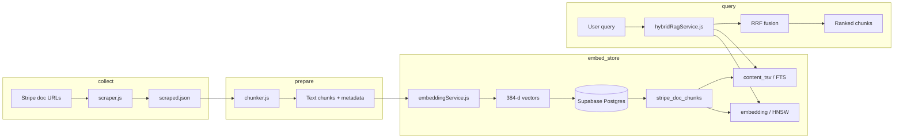
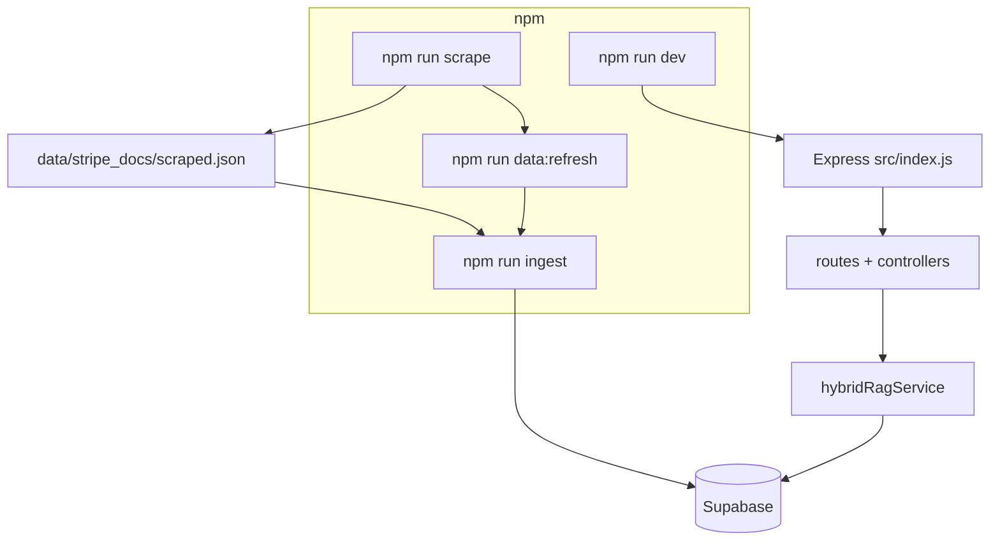

# StripeBot — Backend

Hybrid RAG backend: scrape Stripe docs → **chunk** (token-aware) → **embed** → **Supabase (Postgres + pgvector)** → **keyword + semantic** search fused with **RRF**.

For product context, scope, and trade-offs, see **[PROJECT.md](./PROJECT.md)**.

---

## Pipeline overview



### Commands vs flow



Chunking runs **inside** `ingestVector.js` via `chunkScrapedJSON` from `src/utils/chunker.js` (no separate mandatory chunk step).

---

## Quick start

1. **Install**

   ```bash
   cd PBL4/StripeBot/backend
   npm install
   ```

2. **Configure** `.env`

   - `DATABASE_URL` _or_ `PGHOST`, `PGPORT`, `PGDATABASE`, `PGUSER`, `PGPASSWORD`
   - Optional scrape tuning: `RATE_LIMIT_DELAY`, `SCRAPE_FETCH_TIMEOUT_MS`, `SCRAPE_USER_AGENT`
   - **Chat** (optional): `GEMINI_API_KEY`, `GEMINI_MODEL` (see `gemini.service.js`)
   - **Ingest**: default run **truncates** `stripe_doc_chunks`. Set `INGEST_APPEND=1` to skip truncate (upsert only).

3. **Database (Supabase)**

   In the Supabase **SQL Editor**, run the full file (normal **Run**, not “Explain analyze” for DDL):

   [`src/sql/setup_hybrid.sql`](./src/sql/setup_hybrid.sql)

   This enables `vector`, creates `stripe_doc_chunks` (384-d embeddings, generated `tsvector`, GIN + HNSW indexes).

4. **Scrape → ingest → API**

   ```bash
   npm run scrape
   npm run ingest
   npm run dev
   ```

   One-shot data refresh (scrape + ingest, no server):

   ```bash
   npm run data:refresh
   ```

   First ingest run downloads the embedding model (can be slow).

---

## NPM scripts

| Script                 | Purpose                                                                 |
| ---------------------- | ----------------------------------------------------------------------- |
| `npm run scrape`       | Fetch seed Stripe URLs → `data/stripe_docs/scraped.json`                |
| `npm run ingest`       | Read JSON → `chunkScrapedJSON` → embed → upsert `stripe_doc_chunks`     |
| `npm run data:refresh` | `scrape` then `ingest`                                                  |
| `npm run dev`          | API with `node --watch src/index.js`                                   |
| `npm start`            | API without watch                                                       |
| `npm run chunk`        | Loads `chunker.js` as a module only — **not** a standalone chunk preview. Prefer relying on `ingest` or add a small `scripts/chunkPreview.js` if needed. |

`dev` does **not** auto-scrape or auto-ingest on boot.

---

## HTTP API

Entry: `src/index.js` loads `src/app.js`.

| Method | Path                 | Body / notes                                                                 |
| ------ | -------------------- | ---------------------------------------------------------------------------- |
| `GET`  | `/api/rag`           | DB health (`SELECT now()`). Same handler as legacy “health” demos.           |
| `POST` | `/api/rag/search`    | `{ "query": "string", "keywordLimit"?, "semanticLimit"?, "finalLimit"? }`   |
| `POST` | `/api/chat`          | `{ "prompt": "string" }` → `{ success, data: { reply, userInput } }` (Gemini). |

Example hybrid search:

```bash
curl -s -X POST http://localhost:3000/api/rag/search \
  -H "Content-Type: application/json" \
  -d '{"query":"webhook signature","finalLimit":5}'
```

Health example:

```bash
curl -s http://localhost:3000/api/rag
```

Default port: **3000** (`PORT` env overrides).

---

## Project layout (high signal)

| Path                                 | Role                                                        |
| ------------------------------------ | ----------------------------------------------------------- |
| `src/index.js`                       | `dotenv`, `listen(PORT)`                                    |
| `src/app.js`                         | Express app: JSON middleware, mount routes, error handler |
| `src/routes/chat.routes.js`          | `POST /` → chat                                            |
| `src/routes/rag.routes.js`           | `GET /` health, `POST /search` → RAG                        |
| `src/controllers/rag.controller.js`  | `getHealth`, `handleRagSearch`                            |
| `src/controllers/chat.controller.js` | Chat handler                                               |
| `src/scripts/scraper.js`             | Fetch + Cheerio → `scraped.json`                           |
| `src/scripts/ingestVector.js`        | JSON → chunk → embed → DB                                 |
| `src/utils/chunker.js`               | Token-based chunking (`chunkScrapedJSON`)                   |
| `src/utils/tokenCounter.js`          | tiktoken helpers for chunk sizing                         |
| `src/services/embeddingService.js`   | `Xenova/all-MiniLM-L6-v2` (384-d, mean pool, normalized)   |
| `src/services/hybridRagService.js`   | FTS + vector + RRF                                        |
| `src/config/db.js`                   | `pg` pool + `pgvector` type registration                  |
| `src/sql/setup_hybrid.sql`           | Schema for hybrid RAG                                     |

Legacy: `src/sql/setup.sql` (if present) may target older tables; **hybrid flow uses `setup_hybrid.sql`**.

---

## Ingest behavior

- **Truncate:** Unless `INGEST_APPEND=1`, ingest runs `TRUNCATE stripe_doc_chunks RESTART IDENTITY` before upserts.
- **Chunking:** Defaults in `chunker.js`: `maxChunkTokens` 800, `overlapTokens` 100 (pass options from ingest if you extend the script).
- **Upsert key:** `(source_doc_id, chunk_index)` per `setup_hybrid.sql`.

---

## Supabase SQL editor tips

- Do **not** run `CREATE EXTENSION` / `CREATE TABLE` with **Explain analyze** enabled (invalid for DDL).
- Query **`stripe_doc_chunks`**, not `stripe_docs`, unless you created that table separately.

---

## Troubleshooting

| Symptom                                       | Likely cause                                                                 |
| --------------------------------------------- | ---------------------------------------------------------------------------- |
| `relation "stripe_doc_chunks" does not exist` | Run `setup_hybrid.sql` on the **same** DB as `.env`.                         |
| `EXPLAIN ANALYZE CREATE EXTENSION` error      | Turn off analyze/explain mode; run plain `CREATE EXTENSION ...`.             |
| `Headers is not defined` (transformers)       | `embeddingService.js` polyfills fetch/Headers via `undici`; use Node 18+.    |
| Empty keyword hits                            | Stopwords or phrasing; try different query text.                             |
| RAG 500 on keyword leg                        | Ensure `hybridRagService` keyword SQL uses alias `kw_rank` matching `ORDER BY`. |
| Scrape CLI args                               | Use `npm run scrape -- --sources=api --limit=1` (`--` before script args).   |
| Missing `health.controller`                   | Health lives in `rag.controller.js`; routes import from there.              |

---

## Related doc

- **[PROJECT.md](./PROJECT.md)** — architecture notes, scope, risks, maintenance checklist.
