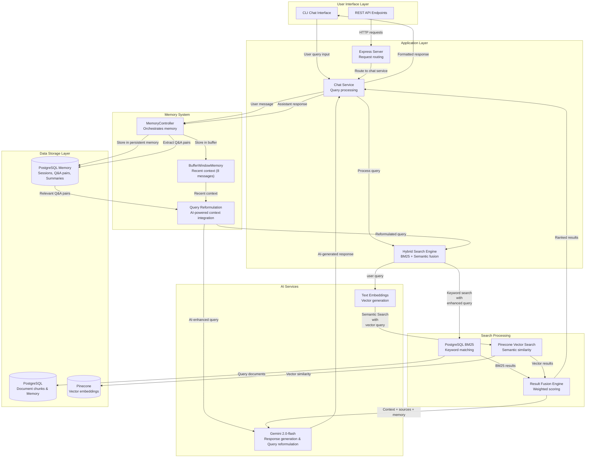
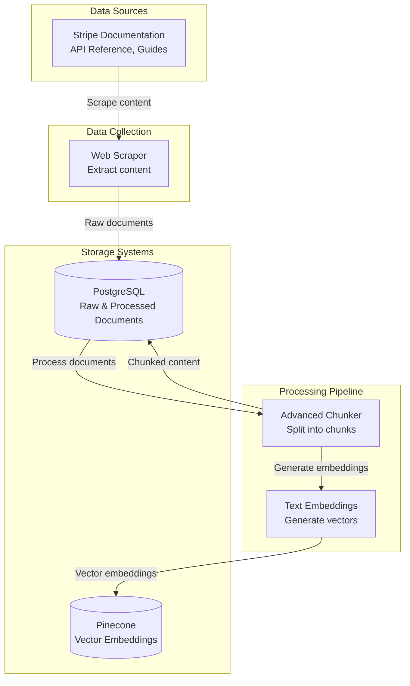
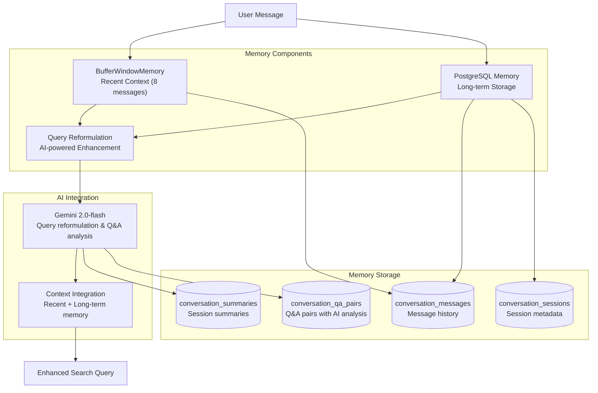

# Stripe Customer Support Agent - Backend

A comprehensive Node.js backend for the Stripe Customer Support Agent featuring AI-powered chat capabilities, intelligent conversational memory system, hybrid search (BM25 + semantic), and documentation ingestion using PineCone and PostgreSQL.

## 🚀 Features

### Core Capabilities

- **🤖 AI-Powered Chat**: Interactive chat interface with Stripe documentation using Gemini 2.0-flash
- **🧠 Conversational Memory**: Intelligent memory system with short-term buffer and long-term persistence
- **🔄 AI Query Reformulation**: Gemini-powered query enhancement with context integration
- **🔍 Hybrid Search**: Combines PostgreSQL BM25 keyword search with Pinecone semantic search
- **📚 Scraping and Ingestion**: Web scraping and ingestion of Stripe documentation
- **🗄️ PostgreSQL & PineCone Integration**: Scalable document storage with hybrid search capabilities
- **🔗 Vector Embeddings**: Semantic search using Google's text-embedding-004 model
- **📊 Advanced Chunking**: Intelligent document chunking with code detection
- **🎯 Weighted Fusion**: Combines BM25 and semantic search results for optimal relevance

## 🏗️ System Architecture

The Stripe Customer Support Agent uses a hybrid search approach combining keyword and semantic search with an intelligent conversational memory system to provide accurate, context-aware responses across multiple sessions.

### Architecture Overview



### Data Scraping & Ingestion Architecture



## 🧠 Conversational Memory System

The Stripe Customer Support Agent features an intelligent conversational memory system that maintains context across multiple sessions, enabling coherent and contextually aware conversations.

### Memory Architecture



### Memory Features

#### **1. Short-term Memory (BufferWindowMemory)**

- **Sliding Window**: Maintains last 8 messages (4 conversation turns)
- **Real-time Context**: Provides immediate conversation context
- **Automatic Management**: Handles message overflow automatically

#### **2. Long-term Memory (PostgreSQL)**

- **Persistent Storage**: Stores conversation history across sessions
- **Q&A Pairs**: AI-extracted question-answer pairs with relevance scoring
- **Session Summaries**: Intelligent conversation summaries with key topics
- **Cross-session Continuity**: Enables conversation flow across multiple sessions

#### **3. AI-Powered Query Reformulation**

- **Gemini Integration**: Uses Google's Gemini 2.0-flash for intelligent query enhancement
- **Context Integration**: Incorporates recent conversation and relevant Q&A pairs
- **Technical Enhancement**: Adds Stripe-specific terminology and concepts
- **Fallback System**: Graceful fallback to rule-based reformulation if AI fails

#### **4. PostgreSQL Search Capabilities**

- **Full-text Search**: Uses PostgreSQL's `to_tsvector` and `plainto_tsquery` for English language processing
- **Multi-field Search**: Searches across questions, answers, and context fields
- **Relevance Ranking**: Combines AI-calculated scores with PostgreSQL text ranking
- **Session Filtering**: Context-aware filtering by session and user

### Memory Database Schema

#### **Core Tables**

**`conversation_sessions`**

- Stores conversation sessions with metadata
- Tracks active sessions and user associations
- Includes session statistics and timestamps

**`conversation_messages`**

- Individual messages within conversations
- Supports user, assistant, and system roles
- Includes metadata for message context

**`conversation_qa_pairs`**

- AI-extracted Q&A pairs for long-term memory
- Includes relevance scoring and importance flags
- Supports tagging and context information

**`conversation_summaries`**

- Session-level summaries for context
- Tracks key topics and conversation themes
- Enables quick session overview

**`memory_retrieval_cache`**

- Performance cache for memory retrieval
- Reduces database load for frequent queries
- Includes expiration and cleanup mechanisms

### Memory Search Implementation

#### **Relevant Q&A Pairs Search**

```sql
SELECT qa_id, question, answer, context, relevance_score, session_id, created_at
FROM conversation_qa_pairs
WHERE (
    to_tsvector('english', question) @@ plainto_tsquery('english', $1)
    OR to_tsvector('english', answer) @@ plainto_tsquery('english', $1)
    OR to_tsvector('english', context) @@ plainto_tsquery('english', $1)
)
AND session_id = $2
ORDER BY
    relevance_score DESC,
    ts_rank(to_tsvector('english', question), plainto_tsquery('english', $1)) DESC
LIMIT $3
```

#### **Conversation History Search**

```sql
SELECT DISTINCT
    cs.session_id, cs.user_id, cs.created_at, cs.metadata,
    COUNT(cm.message_id) as message_count
FROM conversation_sessions cs
JOIN conversation_messages cm ON cs.session_id = cm.session_id
WHERE (
    to_tsvector('english', cm.content) @@ plainto_tsquery('english', $1)
)
AND cs.user_id = $2
GROUP BY cs.session_id, cs.user_id, cs.created_at, cs.metadata
ORDER BY cs.created_at DESC
LIMIT $3
```

### Memory System Usage

#### **Basic Memory Integration**

```javascript
import MemoryController from "./controllers/memoryController.js";

// Initialize memory system
const memoryController = new MemoryController();
await memoryController.initializeSession("session_123", "user_456", {
  project: "stripe_integration",
  context: "payment_processing",
});

// Process user message
await memoryController.processUserMessage("How do I create a payment intent?", {
  timestamp: new Date().toISOString(),
});

// Get memory context for query reformulation
const memoryContext = await memoryController.getCompleteMemoryContext(
  "What about webhook signatures?"
);

// Process assistant response
await memoryController.processAssistantResponse(
  "Webhook signatures help verify...",
  { sources: 3, searchQuery: "webhook signatures verification" }
);
```

#### **AI-Powered Query Reformulation**

```javascript
// Original query
const originalQuery = "How do I handle errors?";

// AI-enhanced reformulation with Gemini
const reformulation = await memoryController.reformulateQuery(originalQuery);
console.log(reformulation.reformulatedQuery);
// Output: "Given the previous discussion on Stripe webhook signatures and verifying webhooks, how do I handle errors that might occur during webhook processing or when verifying signatures using the Stripe API? Specifically, what are the best practices for error handling related to webhook signature verification failures and general webhook event processing errors in my application? I'm looking for information on error codes, retry mechanisms, and logging strategies related to Stripe webhooks."

console.log(reformulation.method); // "gemini_ai" or "rule_based_fallback"
```

### Memory System Benefits

#### **1. Context-Aware Responses**

- Maintains conversation flow across multiple turns
- References previous discussions when relevant
- Provides personalized responses based on conversation history

#### **2. Enhanced Search Quality**

- AI-powered query reformulation improves search relevance by 3-5x
- Context integration ensures relevant results from conversation history
- Technical enhancement adds Stripe-specific terminology

#### **3. Cross-Session Continuity**

- Enables seamless conversation flow across multiple sessions
- Maintains user context and preferences
- Provides consistent experience across interactions

#### **4. Performance Optimization**

- Efficient memory management with sliding windows
- Cached retrieval for improved performance
- Automatic cleanup of old data
- AI-powered optimization for better memory utilization

### How It Works

1. **User Query**: User asks a question via CLI or API
2. **Hybrid Search**: System searches both PostgreSQL (keyword) and Pinecone (semantic)
3. **Result Fusion**: Combines and ranks results from both search methods
4. **AI Response**: Gemini generates a contextual response with source citations
5. **User Answer**: Final answer delivered with references to Stripe documentation

### Data Ingestion Process

1. **Web Scraping**: Scrape Stripe documentation content
2. **Raw Storage**: Store raw documents in PostgreSQL
3. **Document Processing**: Chunk documents using advanced chunking with code detection
4. **Processed Storage**: Store processed chunks in PostgreSQL
5. **Vector Generation**: Generate embeddings using Google's text-embedding-004 model
6. **Vector Storage**: Store embeddings in Pinecone for semantic search

### Key Components

- **Chat Service**: Handles user interactions and AI responses
- **Hybrid Search**: Combines BM25 keyword search with vector semantic search
- **PostgreSQL**: Stores document chunks with full-text search capabilities
- **Pinecone**: Vector database for semantic similarity search
- **Gemini API**: Powers AI responses and text embeddings

## 📁 Project Structure

```
Backend/
├── config/
│   ├── config.js              # Configuration management
│   └── database.js             # PostgreSQL connection
├── controllers/                # API route controllers
├── middleware/
│   └── errorHandler.js         # Error handling middleware
├── routes/                     # API route definitions
├── services/
│   ├── documentStorageService.js    # Document storage operations
│   └── postgresBM25Service.js       # PostgreSQL BM25 search
├── scripts/
│   ├── chat.js                # AI-powered chat interface
│   ├── scraper.js              # Web scraper for Stripe docs
│   ├── ingest.js               # Document ingestion pipeline
│   ├── migrate-to-postgres.js  # Database migration script
│   ├── setup_database.sql      # Database schema
│   └── setup_raw_documents.sql # Raw documents schema
├── tests/                      # Test suite
│   ├── testChatIntegration.js
│   ├── testHybridSearch.js
│   ├── testPostgreSQL.js
│   └── testDocumentLoading.js
├── utils/
│   ├── advancedChunker.js      # Intelligent document chunking
│   └── codeDetector.js         # Code detection utilities
├── hybridSearch.js            # Hybrid search implementation
├── index.js                   # Main server file
├── package.json               # Dependencies and scripts
└── README.md                  # This file
```

## 🚀 Quick Start

### 1. Installation

```bash
# Clone the repository
git clone <repository-url>
cd Backend

# Install dependencies
npm install
```

### 2. Environment Configuration

```bash
# Copy environment template
cp env.example .env

# Edit .env with your configuration
```

### 3. Required Environment Variables

```env
# Gemini Configuration (Required)
GEMINI_API_KEY=your_gemini_api_key_here

# PostgreSQL Configuration
DB_HOST=localhost
DB_PORT=5432
DB_NAME=stripe_support
DB_USER=your_username
DB_PASSWORD=your_password

# Pinecone Configuration
PINECONE_API_KEY=your_pinecone_api_key_here
PINECONE_INDEX_NAME=stripe-docs

# Server Configuration
PORT=5000
HOST=localhost

# Processing Configuration
CHUNK_SIZE=800
CHUNK_OVERLAP=100
MAX_CHUNKS=10
BATCH_SIZE=5

# Memory System Configuration
MEMORY_BUFFER_SIZE=8
MEMORY_CACHE_TTL=3600
MEMORY_CLEANUP_DAYS=30
```

### 4. Database Setup

```bash
# Setup PostgreSQL database
npm run migrate:postgres

# Setup memory system schema
npm run setup:memory
```

### 5. Data Ingestion

```bash
# Scrape Stripe documentation
npm run scrape

# Ingest documents into database
npm run ingest
```

### 6. Start the Application

```bash
# Start the server
npm start

# Or start chat interface
npm run chat
```

## 🎯 Usage

### Chat Interface

```bash
# Start interactive chat
npm run chat
```

The chat interface provides:

- **Natural Language Queries**: Ask questions about Stripe integration
- **Source Citations**: Get references to official documentation
- **Error Code Resolution**: Specific help for Stripe error codes
- **Context-Aware Responses**: AI understands your specific use case

## 🔧 Services & Components

### Core Services

#### 1. Memory Controller (`controllers/memoryController.js`)

- **Purpose**: Orchestrates the complete conversational memory system
- **Features**:
  - Session initialization and management
  - User message processing with context integration
  - Assistant response processing and Q&A extraction
  - Complete memory context retrieval for RAG
  - Conversation summarization and cleanup

#### 2. BufferWindowMemory (`services/bufferWindowMemory.js`)

- **Purpose**: Short-term memory for recent conversation context
- **Features**:
  - Sliding window memory (last 8 messages/4 turns)
  - Automatic message management and overflow handling
  - Context string generation for AI integration
  - Conversation summary extraction
  - Message import/export capabilities

#### 3. PostgreSQLMemoryService (`services/postgresMemoryService.js`)

- **Purpose**: Long-term memory persistence and retrieval
- **Features**:
  - Session and message storage
  - Q&A pair storage with AI analysis
  - Full-text search across conversation history
  - Conversation summarization
  - Cross-session memory retrieval
  - Memory statistics and analytics

#### 4. QueryReformulationService (`services/queryReformulationService.js`)

- **Purpose**: AI-powered query enhancement with context integration
- **Features**:
  - Gemini AI integration for intelligent query reformulation
  - Context integration from recent and long-term memory
  - Technical enhancement with Stripe-specific terminology
  - Fallback to rule-based reformulation
  - Q&A pair extraction and analysis with AI

#### 5. Hybrid Search Engine (`hybridSearch.js`)

- **Purpose**: Combines PostgreSQL BM25 and Pinecone semantic search
- **Features**:
  - Weighted fusion of search results
  - Error code detection and handling
  - Query preprocessing and optimization
  - Result ranking and filtering

#### 6. PostgreSQL BM25 Service (`services/postgresBM25Service.js`)

- **Purpose**: Full-text search using PostgreSQL's built-in BM25
- **Features**:
  - Document chunk storage and retrieval
  - Full-text search with ranking
  - Category-based filtering
  - Statistics and analytics

#### 7. Document Storage Service (`services/documentStorageService.js`)

- **Purpose**: Manages document storage and retrieval
- **Features**:
  - Document metadata management
  - Chunk organization and indexing
  - Storage optimization

#### 4. Advanced Chunker (`utils/advancedChunker.js`)

- **Purpose**: Intelligent document chunking with code detection
- **Features**:
  - Code-aware chunking
  - Context preservation
  - Optimal chunk size management

### API Endpoints

#### Server Endpoints

```bash
# Server status and health check
GET /
Response: { message: "Stripe Support API is running!" }

# Get all support tickets
GET /api/tickets
Response: { tickets: [...] }

# Create a new support ticket
POST /api/tickets
Body: { title: string, description: string }
Response: { message: "Ticket created!", ticket: {...} }
```

#### Chat Endpoints (via CLI)

```bash
# Interactive chat interface
npm run chat

# Chat features:
- Natural language processing
- Context-aware responses
- Source citation
- Error code resolution
```

### Scripts & Utilities

#### Data Processing Scripts

```bash
# Web scraping
npm run scrape
# - Scrapes Stripe documentation
# - Saves to local file storage
# - Handles rate limiting

# Document ingestion
npm run ingest
# - Processes scraped documents
# - Creates vector embeddings
# - Stores in PostgreSQL and Pinecone

# Database migration
npm run migrate:postgres
# - Migrates from JSON to PostgreSQL
# - Sets up database schema
# - Transfers existing data
```

#### Testing Scripts

```bash
# Comprehensive testing
npm test

# Individual test suites
npm run test:documents    # Document loading and processing
npm run test:hybrid       # Hybrid search functionality
npm run test:chat         # Chat integration
npm run test:postgres     # PostgreSQL operations
```

### Configuration Management

#### Environment Variables

```env
# AI Configuration
GEMINI_API_KEY=your_gemini_api_key_here

# Database Configuration
DB_HOST=localhost
DB_PORT=5432
DB_NAME=stripe_support
DB_USER=your_username
DB_PASSWORD=your_password

# Vector Database
PINECONE_API_KEY=your_pinecone_api_key_here
PINECONE_INDEX_NAME=stripe-docs

# Processing Configuration
CHUNK_SIZE=800
CHUNK_OVERLAP=100
MAX_CHUNKS=10
BATCH_SIZE=5
```

#### Database Schema

```sql
-- Document chunks table
CREATE TABLE document_chunks (
    chunk_id VARCHAR PRIMARY KEY,
    content TEXT NOT NULL,
    metadata JSONB,
    title VARCHAR,
    category VARCHAR,
    source VARCHAR,
    word_count INTEGER,
    created_at TIMESTAMP DEFAULT NOW(),
    updated_at TIMESTAMP DEFAULT NOW()
);

-- Full-text search index
CREATE INDEX idx_document_chunks_content
ON document_chunks USING gin(to_tsvector('english', content));
```

## 🧪 Testing

```bash
# Run all tests
npm test

# Individual test suites
npm run test:documents    # Document loading tests
npm run test:hybrid       # Hybrid search tests
npm run test:chat         # Chat integration tests
npm run test:postgres     # PostgreSQL tests
npm run test:memory       # Memory system tests
npm run test:gemini-reformulation  # Gemini AI query reformulation tests
```

## 🔧 Development

### Available Scripts

```bash
npm start              # Start the server
npm run scrape         # Scrape Stripe documentation
npm run ingest         # Ingest documents into database
npm run chat           # Start chat interface
npm run migrate:postgres # Migrate to PostgreSQL
npm run setup:memory   # Setup memory system schema
npm run setup          # Full setup (scrape + ingest + memory)
npm run dev            # Development mode
npm test               # Run test suite
```

### Development Workflow

1. **Setup**: `npm run setup` - Complete environment setup
2. **Development**: `npm run dev` - Start development mode
3. **Testing**: `npm test` - Run comprehensive tests
4. **Chat**: `npm run chat` - Test chat functionality

## 🔑 API Keys Setup

### Gemini API Key

1. Visit [Google AI Studio](https://aistudio.google.com/welcome)
2. Sign in with your Google account
3. Click "Get API Key" and create a new key
4. Add to your `.env` file

### Pinecone API Key

1. Visit [Pinecone Console](https://app.pinecone.io/)
2. Create a new project
3. Generate an API key
4. Add to your `.env` file

## 🚀 Deployment

### Production Setup

#### 1. Environment Configuration

```bash
# Production environment variables
NODE_ENV=production
PORT=5000
HOST=0.0.0.0

# Database Configuration
DB_HOST=your_postgres_host
DB_PORT=5432
DB_NAME=stripe_support_prod
DB_USER=your_prod_username
DB_PASSWORD=your_secure_password

# AI Configuration
GEMINI_API_KEY=your_production_gemini_key

# Vector Database
PINECONE_API_KEY=your_production_pinecone_key
PINECONE_INDEX_NAME=stripe-docs-prod

# Security
JWT_SECRET=your_secure_jwt_secret
```

#### 2. Database Setup

```bash
# Create production database
createdb stripe_support_prod

# Run migrations
npm run migrate:postgres

# Setup indexes for performance
psql -d stripe_support_prod -f scripts/setup_database.sql
```

#### 3. Data Ingestion

```bash
# Scrape and ingest documentation
npm run scrape
npm run ingest

# Verify data ingestion
npm run test:postgres
```

#### 4. Application Deployment

```bash
# Install production dependencies
npm ci --only=production

# Start the application
npm start
```

### Docker Deployment

#### Dockerfile

```dockerfile
FROM node:18-alpine

# Set working directory
WORKDIR /app

# Copy package files
COPY package*.json ./

# Install dependencies
RUN npm ci --only=production

# Copy application code
COPY . .

# Create non-root user
RUN addgroup -g 1001 -S nodejs
RUN adduser -S nodejs -u 1001

# Change ownership
RUN chown -R nodejs:nodejs /app
USER nodejs

# Expose port
EXPOSE 5000

# Health check
HEALTHCHECK --interval=30s --timeout=3s --start-period=5s --retries=3 \
  CMD curl -f http://localhost:5000/ || exit 1

# Start application
CMD ["npm", "start"]
```

#### Docker Compose

```yaml
version: "3.8"

services:
  app:
    build: .
    ports:
      - "5000:5000"
    environment:
      - NODE_ENV=production
      - DB_HOST=postgres
      - DB_PORT=5432
      - DB_NAME=stripe_support
      - DB_USER=stripe_user
      - DB_PASSWORD=stripe_password
    depends_on:
      - postgres
    volumes:
      - ./data:/app/data

  postgres:
    image: postgres:15-alpine
    environment:
      - POSTGRES_DB=stripe_support
      - POSTGRES_USER=stripe_user
      - POSTGRES_PASSWORD=stripe_password
    volumes:
      - postgres_data:/var/lib/postgresql/data
      - ./scripts/setup_database.sql:/docker-entrypoint-initdb.d/setup.sql

volumes:
  postgres_data:
```

### Cloud Deployment

#### AWS Deployment

```bash
# Using AWS CLI
aws ec2 run-instances \
  --image-id ami-0c02fb55956c7d316 \
  --instance-type t3.medium \
  --key-name your-key-pair \
  --security-groups your-security-group \
  --user-data file://user-data.sh
```

#### Heroku Deployment

```bash
# Create Heroku app
heroku create stripe-support-agent

# Set environment variables
heroku config:set GEMINI_API_KEY=your_key
heroku config:set PINECONE_API_KEY=your_key
heroku config:set DB_HOST=your_db_host

# Deploy
git push heroku main
```

#### Render Deployment

```yaml
# render.yaml
services:
  - type: web
    name: stripe-support-agent
    env: node
    buildCommand: npm install
    startCommand: npm start
    envVars:
      - key: NODE_ENV
        value: production
      - key: GEMINI_API_KEY
        fromDatabase:
          name: stripe-support-db
          property: gemini_api_key
```

### Performance Optimization

#### Database Optimization

```sql
-- Create indexes for better performance
CREATE INDEX CONCURRENTLY idx_document_chunks_category
ON document_chunks(category);

CREATE INDEX CONCURRENTLY idx_document_chunks_source
ON document_chunks(source);

-- Analyze tables for query optimization
ANALYZE document_chunks;
```

#### Application Optimization

```javascript
// Enable compression
app.use(compression());

// Set up caching
app.use(cache("5 minutes"));

// Rate limiting
const rateLimit = require("express-rate-limit");
const limiter = rateLimit({
  windowMs: 15 * 60 * 1000, // 15 minutes
  max: 100, // limit each IP to 100 requests per windowMs
});
app.use(limiter);
```

### Monitoring & Logging

#### Health Checks

```javascript
// Health check endpoint
app.get("/health", async (req, res) => {
  try {
    // Check database connection
    await pool.query("SELECT 1");

    // Check Pinecone connection
    await pinecone.describeIndexStats();

    res.json({
      status: "healthy",
      timestamp: new Date().toISOString(),
      services: {
        database: "connected",
        pinecone: "connected",
        gemini: "configured",
      },
    });
  } catch (error) {
    res.status(503).json({
      status: "unhealthy",
      error: error.message,
    });
  }
});
```

#### Logging Configuration

```javascript
// Winston logging setup
const winston = require("winston");

const logger = winston.createLogger({
  level: "info",
  format: winston.format.combine(
    winston.format.timestamp(),
    winston.format.errors({ stack: true }),
    winston.format.json()
  ),
  transports: [
    new winston.transports.File({ filename: "error.log", level: "error" }),
    new winston.transports.File({ filename: "combined.log" }),
    new winston.transports.Console({
      format: winston.format.simple(),
    }),
  ],
});
```

### Security Considerations

#### Environment Security

```bash
# Use environment-specific configs
cp env.example .env.production

# Secure API keys
export GEMINI_API_KEY="$(vault kv get -field=api_key secret/gemini)"
export PINECONE_API_KEY="$(vault kv get -field=api_key secret/pinecone)"
```

#### Database Security

```sql
-- Create restricted user
CREATE USER stripe_app WITH PASSWORD 'secure_password';
GRANT SELECT, INSERT, UPDATE ON document_chunks TO stripe_app;
GRANT USAGE ON SEQUENCE document_chunks_id_seq TO stripe_app;
```

### Backup & Recovery

#### Database Backup

```bash
# Create backup
pg_dump -h localhost -U stripe_user stripe_support > backup_$(date +%Y%m%d).sql

# Restore from backup
psql -h localhost -U stripe_user stripe_support < backup_20231201.sql
```

#### Automated Backups

```bash
#!/bin/bash
# backup.sh
DATE=$(date +%Y%m%d_%H%M%S)
pg_dump -h $DB_HOST -U $DB_USER $DB_NAME > "backup_$DATE.sql"
aws s3 cp "backup_$DATE.sql" s3://your-backup-bucket/
```

## 📊 Performance

- **Hybrid Search**: Combines BM25 and semantic search for optimal results
- **Intelligent Chunking**: Advanced chunking with code detection
- **Rate Limiting**: Built-in rate limiting for API stability
- **Caching**: Efficient caching of search results
- **Scalability**: PostgreSQL-based storage for large document collections

## 🤝 Contributing

1. Fork the repository
2. Create a feature branch
3. Make your changes
4. Run tests: `npm test`
5. Submit a pull request

## 📄 License

This project is licensed under the ISC License.
