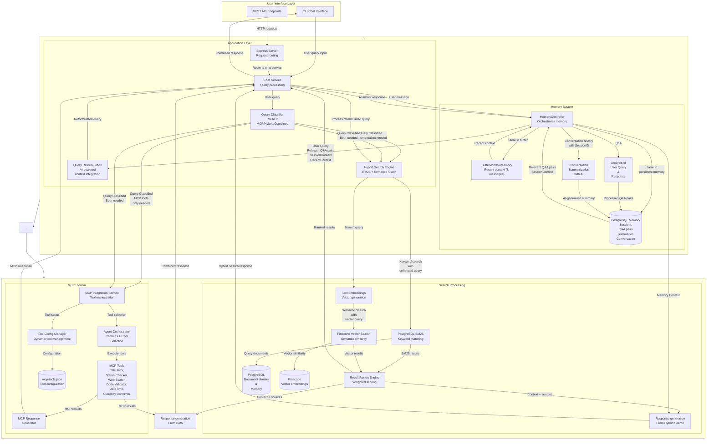
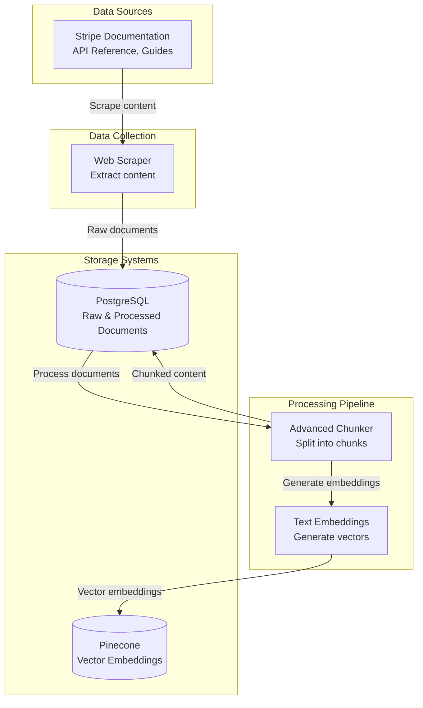
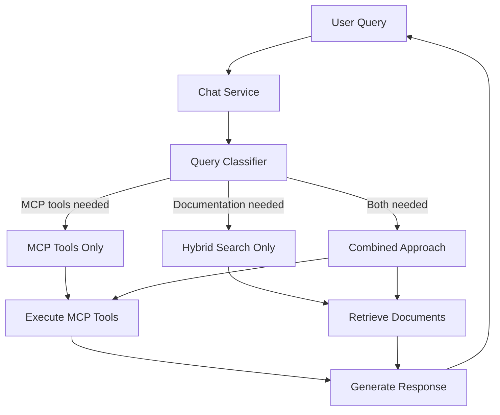
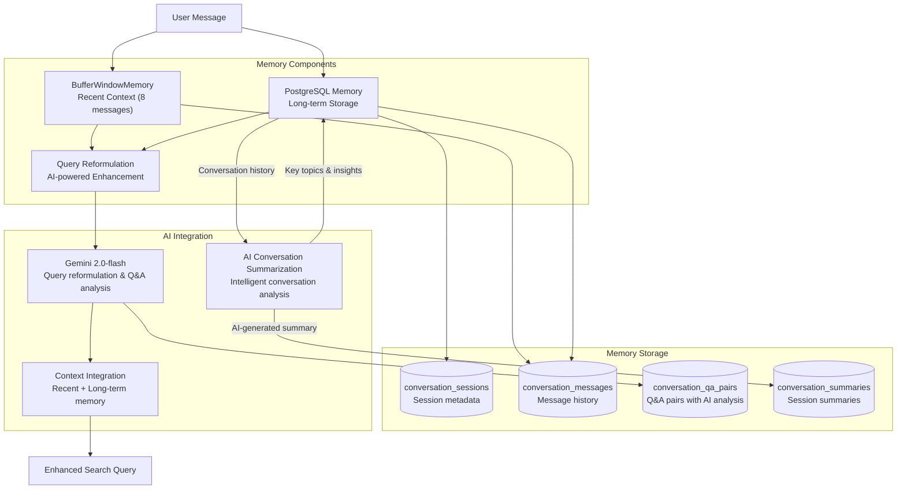

# Stripe Customer Support Agent -( Backend )

A comprehensive Node.js backend for the Stripe Customer Support Agent featuring AI-powered chat capabilities, intelligent conversational memory system, hybrid search (BM25 + semantic), and documentation ingestion using PineCone and PostgreSQL.

## 🚀 Features

### Core Capabilities

- **🤖 AI-Powered Chat**: Interactive chat interface with Stripe documentation using Gemini 2.0-flash
- **🧠 Conversational Memory**: Intelligent memory system with short-term buffer and long-term persistence
- **🔄 AI Query Reformulation**: Gemini-powered query enhancement with context integration
- **📝 AI Conversation Summarization**: Intelligent conversation summaries using Gemini AI for better context retention
- **🔍 Hybrid Search**: Combines PostgreSQL BM25 keyword search with Pinecone semantic search
- **📚 Scraping and Ingestion**: Web scraping and ingestion of Stripe documentation
- **🗄️ PostgreSQL & Pinecone Integration**: Scalable document storage with hybrid search capabilities
- **🔗 Vector Embeddings**: Semantic search using Google's text-embedding-004 model
- **📊 Advanced Chunking**: Intelligent document chunking with code detection
- **🎯 Weighted Fusion**: Combines BM25 and semantic search results for optimal relevance
- <details>
    <summary><strong>🛠️ MCP Tool Integration (Toggleable)</strong>: Model Context Protocol tools for enhanced query processing</summary>

  - **🧮 Calculator Tool**: Mathematical calculations and Stripe fee computations
  - **⚠️ Status Checker**: Real-time Stripe system status monitoring
  - **🔍 Web Search**: Enhanced web search capabilities for current information
  - **✅ Code Validator**: Code validation and syntax checking
  - **📅 DateTime Tool**: Date and time operations and formatting
  - **💱 Currency Converter**: Currency conversion for global payments and multi-currency queries

  <em>MCP Tool Integration can be enabled/disabled via environment/configuration.</em>
  </details>

## 🏗️ System Architecture

The Stripe Customer Support Agent uses a hybrid search approach combining keyword and semantic search with an intelligent conversational memory system to provide accurate, context-aware responses across multiple sessions.

### Architecture Overview



### Data Scraping & Ingestion Architecture

1. **Web Scraping**: Scrape Stripe documentation content
2. **Raw Storage**: Store raw documents in PostgreSQL
3. **Document Processing**: Chunk documents using advanced chunking with code detection
4. **Processed Storage**: Store processed chunks in PostgreSQL
5. **Vector Generation**: Generate embeddings using Google's text-embedding-004 model
6. **Vector Storage**: Store embeddings in Pinecone for semantic search



## 🔧 MCP Tool Integration

The Stripe Customer Support Agent includes **Model Context Protocol (MCP)** tool integration, providing specialized tools for enhanced query processing and intelligent responses.



### 🛠️ Available MCP Tools

- **🧮 Calculator Tool**: Mathematical calculations and Stripe fee computations
- **⚠️ Status Checker**: Real-time Stripe system status monitoring
- **🔍 Web Search**: Enhanced web search capabilities for current information using google custom engine
- **✅ Code Validator**: Code validation and syntax checking
- **📅 DateTime Tool**: Date and time operations and formatting
- **💱 Currency Converter**: Currency conversion for global payments and multi-currency queries

### 🎯 Key Features

- **🤖 Intelligent Tool Selection**: AI automatically selects appropriate tools based on query context
- **🔄 Seamless Integration**: Tools work seamlessly with existing chat and memory systems
- **📊 Confidence Scoring**: Each tool response includes confidence levels for better decision making
- **🛡️ Error Handling**: Robust error handling with fallback mechanisms

### 🚀 Quick Start

```bash
# Test MCP integration
npm run test:mcp

# Run interactive MCP demo
npm run demo:mcp

# Start MCP-enhanced chat
node examples/mcpChatExample.js
```

> 📖 **For detailed MCP documentation, see [MCP_DOCUMENTATION.md](../docs/mcp/MCP_DOCUMENTATION.md)**

> 📖 **For detailed Agent Orchestrator documentation, see [AGENT_ORCHESTRATOR_ANALYSIS.md](../docs/mcp/AGENT_ORCHESTRATOR_ANALYSIS.md)**

> 📖 **For detailed Query Classifier documentation, see [QUERY_CLASSIFIER_INTEGRATION.md](../docs/mcp/QUERY_CLASSIFIER_INTEGRATION.md)**

> 📖 **For detailed Google Search Setup documentation, see [GOOGLE_SEARCH_SETUP.md](../docs/GOOGLE_SEARCH_SETUP.md)**

## 🧠 Conversational Memory System

The Stripe Customer Support Agent features an intelligent conversational memory system that maintains context across multiple sessions, enabling coherent and contextually aware conversations.

### Memory Architecture



### Memory Features

<details>
  <summary><strong>1. Short-term Memory (<code>BufferWindowMemory</code>) <em>(Toggle details)</em></strong></summary>

- <strong>Togglable:</strong> Enable or disable via configuration/environment settings.
- <strong>Sliding Window</strong>: Maintains last 8 messages (4 conversation turns)
- <strong>Real-time Context</strong>: Provides immediate conversation context
- <strong>Automatic Management</strong>: Handles message overflow automatically

</details>

<details>
  <summary><strong>2. Long-term Memory (<code>PostgreSQL</code>) <em>(Toggle details)</em></strong></summary>

- <strong>Togglable:</strong> Enable or disable persistent storage of conversation history
- <strong>Persistent Storage</strong>: Stores conversation history across sessions
- <strong>Q&A Pairs</strong>: AI-extracted question-answer pairs with relevance scoring
- <strong>Session Summaries</strong>: Intelligent conversation summaries with key topics
- <strong>Cross-session Continuity</strong>: Enables conversation flow across multiple sessions

</details>

<details>
  <summary><strong>3. AI-Powered Query Reformulation <em>(Toggle details)</em></strong></summary>

- <strong>Togglable:</strong> Enable or disable AI reformulation (Gemini)
- <strong>Gemini Integration</strong>: Uses Google's Gemini 2.0-flash for intelligent query enhancement
- <strong>Context Integration</strong>: Incorporates recent conversation and relevant Q&A pairs
- <strong>Technical Enhancement</strong>: Adds Stripe-specific terminology and concepts
- <strong>Fallback System</strong>: Graceful fallback to rule-based reformulation if AI fails

</details>

<details>
  <summary><strong>4. AI-Powered Conversation Summarization <em>(Toggle details)</em></strong></summary>

- <strong>Togglable:</strong> Enable or disable Gemini-powered summarization
- <strong>Gemini AI Integration</strong>: Uses Google's Gemini 2.0-flash for intelligent conversation analysis
- <strong>Comprehensive Analysis</strong>: Identifies main issues, solutions, outcomes, and technical details
- <strong>Context-Aware Summaries</strong>: Incorporates key topics and conversation themes
- <strong>Intelligent Fallback</strong>: Graceful degradation to rule-based summarization if AI unavailable
- <strong>Optimized Configuration</strong>: Uses appropriate temperature and token limits for consistent summaries

</details>

<details>
  <summary><strong>5. PostgreSQL Search Capabilities <em>(Toggle details)</em></strong></summary>

- <strong>Togglable:</strong> Enable or disable enhanced PostgreSQL-based search
- <strong>Full-text Search</strong>: Uses PostgreSQL's <code>to_tsvector</code> and <code>plainto_tsquery</code> for English language processing
- <strong>Multi-field Search</strong>: Searches across questions, answers, and context fields
- <strong>Relevance Ranking</strong>: Combines AI-calculated scores with PostgreSQL text ranking
- <strong>Session Filtering</strong>: Context-aware filtering by session and user

</details>

### Memory Database Schema

#### **Core Tables**

<details>
  <summary><strong><code>conversation_sessions</code></strong> <em>(Toggle details)</em></summary>

- Stores conversation sessions with metadata
- Tracks active sessions and user associations
- Includes session statistics and timestamps

</details>

<details>
  <summary><strong><code>conversation_messages</code></strong> <em>(Toggle details)</em></summary>

- Individual messages within conversations
- Supports user, assistant, and system roles
- Includes metadata for message context

</details>

<details>
  <summary><strong><code>conversation_qa_pairs</code></strong> <em>(Toggle details)</em></summary>

- AI-extracted Q&A pairs for long-term memory
- Includes relevance scoring and importance flags
- Supports tagging and context information

</details>

<details>
  <summary><strong><code>conversation_summaries</code></strong> <em>(Toggle details)</em></summary>

- Session-level summaries for context
- Tracks key topics and conversation themes
- Enables quick session overview

</details>

<details>
  <summary><strong><code>memory_retrieval_cache</code></strong> <em>(Toggle details)</em></summary>

- Performance cache for memory retrieval
- Reduces database load for frequent queries
- Includes expiration and cleanup mechanisms

</details>

### Memory Search Implementation

#### **Relevant Q&A Pairs Search**

```sql
SELECT qa_id, question, answer, context, relevance_score, session_id, created_at
FROM conversation_qa_pairs
WHERE (
    to_tsvector('english', question) @@ plainto_tsquery('english', $1)
    OR to_tsvector('english', answer) @@ plainto_tsquery('english', $1)
    OR to_tsvector('english', context) @@ plainto_tsquery('english', $1)
)
AND session_id = $2
ORDER BY
    relevance_score DESC,
    ts_rank(to_tsvector('english', question), plainto_tsquery('english', $1)) DESC
LIMIT $3
```

#### **Conversation History Search**

```sql
SELECT DISTINCT
    cs.session_id, cs.user_id, cs.created_at, cs.metadata,
    COUNT(cm.message_id) as message_count
FROM conversation_sessions cs
JOIN conversation_messages cm ON cs.session_id = cm.session_id
WHERE (
    to_tsvector('english', cm.content) @@ plainto_tsquery('english', $1)
)
AND cs.user_id = $2
GROUP BY cs.session_id, cs.user_id, cs.created_at, cs.metadata
ORDER BY cs.created_at DESC
LIMIT $3
```

### Memory System Usage

#### **Basic Memory Integration**

```javascript
import MemoryController from "./controllers/memoryController.js";

// Initialize memory system
const memoryController = new MemoryController();
await memoryController.initializeSession("session_123", "user_456", {
  project: "stripe_integration",
  context: "payment_processing",
});

// Process user message
await memoryController.processUserMessage("How do I create a payment intent?", {
  timestamp: new Date().toISOString(),
});

// Get memory context for query reformulation
const memoryContext = await memoryController.getCompleteMemoryContext(
  "What about webhook signatures?"
);

// Process assistant response
await memoryController.processAssistantResponse(
  "Webhook signatures help verify...",
  { sources: 3, searchQuery: "webhook signatures verification" }
);
```

#### **AI-Powered Query Reformulation**

```javascript
// Original query
const originalQuery = "How do I handle errors?";

// AI-enhanced reformulation with Gemini
const reformulation = await memoryController.reformulateQuery(originalQuery);
console.log(reformulation.reformulatedQuery);
// Output: "Given the previous discussion on Stripe webhook signatures and verifying webhooks, how do I handle errors that might occur during webhook processing or when verifying signatures using the Stripe API? Specifically, what are the best practices for error handling related to webhook signature verification failures and general webhook event processing errors in my application? I'm looking for information on error codes, retry mechanisms, and logging strategies related to Stripe webhooks."

console.log(reformulation.method); // "gemini_ai" or "rule_based_fallback"
```

### Memory System Benefits

<details>
  <summary><strong>1. Context-Aware Responses <em>(toggleable)</em></strong></summary>

- Maintains conversation flow across multiple turns _(can be enabled/disabled)_
- References previous discussions when relevant _(toggleable)_
- Provides personalized responses based on conversation history _(toggleable)_

</details>

<details>
  <summary><strong>2. Enhanced Search Quality <em>(toggleable)</em></strong></summary>

- AI-powered query reformulation to improve search relevance by 3-5x _(toggleable: AI reformulation)_
- Context integration to ensure relevant results from conversation history _(toggleable: context injection)_
- Technical enhancement to add Stripe-specific terminology _(toggleable: terminology enrichment)_

</details>

<details>
  <summary><strong>3. Cross-Session Continuity <em>(toggleable)</em></strong></summary>

- Seamless conversation flow across multiple sessions _(toggleable: memory persistence)_
- Maintains user context and preferences _(toggleable)_
- Consistent experience across interactions _(toggleable)_

</details>

<details>
  <summary><strong>4. Performance Optimization <em>(toggleable)</em></strong></summary>

- Efficient memory management with sliding windows _(toggleable: sliding window size/activation)_
- Cached retrieval for improved performance _(toggleable: cache on/off)_
- Automatic cleanup of old data _(toggleable: retention policy)_
- AI-powered optimization for better memory utilization _(toggleable: AI memory optimization)_

</details>

### AI Conversation Summarization

The system features intelligent conversation summarization powered by Gemini AI, providing comprehensive analysis of customer support interactions.

#### **Features**

- **Intelligent Analysis**: AI identifies main issues, solutions, and outcomes
- **Context Preservation**: Captures technical details and conversation themes
- **Structured Summaries**: Organized summaries with key points and next steps
- **Fallback Support**: Rule-based summarization when AI is unavailable

#### **Usage Example**

```javascript
// Create conversation summary with AI
const summary = await memoryController.createConversationSummary();

// The AI generates comprehensive summaries like:
/*
"Customer Support Session Summary:

The user encountered issues with Stripe webhook signature verification while implementing payment processing. The main problem was related to incorrect signature validation logic in their Node.js application. 

Key solutions provided included:
1. Proper webhook signature verification using Stripe's webhook signing secret
2. Implementation of secure signature comparison to prevent timing attacks
3. Error handling for invalid signatures with appropriate logging

The conversation covered technical implementation details including code examples for Express.js middleware, environment variable configuration, and testing strategies using Stripe CLI. The user was provided with complete working code samples and best practices for production deployment.

Next steps: The user should implement the provided signature verification middleware and test using Stripe's webhook testing tools before going live."
*/
```

#### **AI Summarization Benefits**

- **Comprehensive Coverage**: Captures all important aspects of the conversation
- **Technical Accuracy**: Preserves technical details and implementation specifics
- **Actionable Insights**: Identifies next steps and follow-up actions
- **Context Retention**: Maintains conversation flow for future reference

### How It Works

1. **User Query**: User asks a question via CLI or API
2. **Hybrid Search**: System searches both PostgreSQL (keyword) and Pinecone (semantic)
3. **Result Fusion**: Combines and ranks results from both search methods
4. **AI Response**: Gemini generates a contextual response with source citations
5. **User Answer**: Final answer delivered with references to Stripe documentation

## 📁 Project Structure

```
Backend/
├── config/
│   ├── config.js              # Configuration management
│   └── database.js             # PostgreSQL connection
├── controllers/                # API route controllers
├── middleware/
│   └── errorHandler.js         # Error handling middleware
├── routes/                     # API route definitions
├── services/
│   ├── documentStorageService.js    # Document storage operations
│   ├── postgresBM25Service.js       # PostgreSQL BM25 search
│   ├── mcpIntegrationService.js     # MCP integration service
│   ├── mcp-server/                  # MCP server components
│   │   ├── agentOrchestrator.js    # MCP tool coordinator
│   │   ├── aiToolSelectionService.js # AI-powered tool selection
│   │   └── toolConfigManager.js    # Tool configuration manager
│   └── mcp-tools/                  # MCP tool implementations
│       ├── calculatorTool.js       # Mathematical calculations
│       ├── statusCheckerTool.js     # System status checking
│       ├── webSearchTool.js         # Web search functionality
│       ├── codeValidatorTool.js     # Code validation
│       └── dateTimeTool.js          # Date/time operations
├── scripts/
│   ├── chat.js                # AI-powered chat interface
│   ├── mcpDemo.js             # MCP integration demo
│   ├── scraper.js              # Web scraper for Stripe docs
│   ├── ingest.js               # Document ingestion pipeline
│   ├── migrate-to-postgres.js  # Database migration script
│   ├── setup_database.sql      # Database schema
│   └── setup_raw_documents.sql # Raw documents schema
├── examples/
│   └── mcpChatExample.js       # MCP-enhanced chat example
├── tests/                      # Test suite
│   ├── testChatIntegration.js
│   ├── testHybridSearch.js
│   ├── testPostgreSQL.js
│   ├── testDocumentLoading.js
│   └── testMCPIntegration.js   # MCP integration tests
├── utils/
│   ├── advancedChunker.js      # Intelligent document chunking
│   └── codeDetector.js         # Code detection utilities
├── hybridSearch.js            # Hybrid search implementation
├── index.js                   # Main server file
├── package.json               # Dependencies and scripts
└── README.md                  # This file
```

## 🚀 Quick Start

### 1. Installation

```bash
# Clone the repository
git clone <repository-url>
cd Backend

# Install dependencies
npm install
```

### 2. Environment Configuration

```bash
# Copy environment template
cp env.example .env

# Edit .env with your configuration
```

### 3. Required Environment Variables

```env
# Gemini Configuration (Required)
GEMINI_API_KEY=your_gemini_api_key_here

# PostgreSQL Configuration
DB_HOST=localhost
DB_PORT=5432
DB_NAME=stripe_support
DB_USER=your_username
DB_PASSWORD=your_password

# Pinecone Configuration
PINECONE_API_KEY=your_pinecone_api_key_here
PINECONE_INDEX_NAME=stripe-docs

# Server Configuration
PORT=5000
HOST=localhost

# Processing Configuration
CHUNK_SIZE=800
CHUNK_OVERLAP=100
MAX_CHUNKS=10
BATCH_SIZE=5

# Memory System Configuration
MEMORY_BUFFER_SIZE=8
MEMORY_CACHE_TTL=3600
MEMORY_CLEANUP_DAYS=30
```

### 4. Database Setup

```bash
# Setup PostgreSQL database
npm run migrate:postgres

# Setup memory system schema
npm run setup:memory
```

### 5. Data Ingestion

```bash
# Scrape Stripe documentation
npm run scrape

# Ingest documents into database
npm run ingest
```

### 6. Start the Application

```bash
# Start the server
npm start

# Or start chat interface
npm run chat
```

## 🎯 Usage

### Chat Interface

```bash
# Start interactive chat
npm run chat
```

The chat interface provides:

- **Natural Language Queries**: Ask questions about Stripe integration
- **Source Citations**: Get references to official documentation
- **Error Code Resolution**: Specific help for Stripe error codes
- **Context-Aware Responses**: AI understands your specific use case

## 🔧 Services & Components

### Core Services

#### 1. Memory Controller (`controllers/memoryController.js`)

- **Purpose**: Orchestrates the complete conversational memory system
- **Features**:
  - Session initialization and management
  - User message processing with context integration
  - Assistant response processing and Q&A extraction
  - Complete memory context retrieval for RAG
  - AI-powered conversation summarization with Gemini
  - Intelligent fallback to rule-based summarization
  - Conversation cleanup and memory optimization

#### 2. BufferWindowMemory (`services/bufferWindowMemory.js`)

- **Purpose**: Short-term memory for recent conversation context
- **Features**:
  - Sliding window memory (last 8 messages/4 turns)
  - Automatic message management and overflow handling
  - Context string generation for AI integration
  - Conversation summary extraction
  - Message import/export capabilities

#### 3. PostgreSQLMemoryService (`services/postgresMemoryService.js`)

- **Purpose**: Long-term memory persistence and retrieval
- **Features**:
  - Session and message storage
  - Q&A pair storage with AI analysis
  - Full-text search across conversation history
  - AI-powered conversation summarization storage
  - Cross-session memory retrieval
  - Intelligent summary retrieval and search
  - Memory statistics and analytics

#### 4. QueryReformulationService (`services/queryReformulationService.js`)

- **Purpose**: AI-powered query enhancement with context integration
- **Features**:
  - Gemini AI integration for intelligent query reformulation
  - Context integration from recent and long-term memory
  - Technical enhancement with Stripe-specific terminology
  - Fallback to rule-based reformulation
  - Q&A pair extraction and analysis with AI

#### 5. Hybrid Search Engine (`hybridSearch.js`)

- **Purpose**: Combines PostgreSQL BM25 and Pinecone semantic search
- **Features**:
  - Weighted fusion of search results
  - Error code detection and handling
  - Query preprocessing and optimization
  - Result ranking and filtering

#### 6. PostgreSQL BM25 Service (`services/postgresBM25Service.js`)

- **Purpose**: Full-text search using PostgreSQL's built-in BM25
- **Features**:
  - Document chunk storage and retrieval
  - Full-text search with ranking
  - Category-based filtering
  - Statistics and analytics

#### 7. Document Storage Service (`services/documentStorageService.js`)

- **Purpose**: Manages document storage and retrieval
- **Features**:
  - Document metadata management
  - Chunk organization and indexing
  - Storage optimization

#### 4. Advanced Chunker (`utils/advancedChunker.js`)

- **Purpose**: Intelligent document chunking with code detection
- **Features**:
  - Code-aware chunking
  - Context preservation
  - Optimal chunk size management

### API Endpoints

#### Server Endpoints

```bash
# Server status and health check
GET /
Response: { message: "Stripe Support API is running!" }

# Get all support tickets
GET /api/tickets
Response: { tickets: [...] }

# Create a new support ticket
POST /api/tickets
Body: { title: string, description: string }
Response: { message: "Ticket created!", ticket: {...} }
```

#### Chat Endpoints (via CLI)

```bash
# Interactive chat interface
npm run chat

# Chat features:
- Natural language processing
- Context-aware responses
- Source citation
- Error code resolution
```

### Scripts & Utilities

#### Data Processing Scripts

```bash
# Web scraping
npm run scrape
# - Scrapes Stripe documentation
# - Saves to local file storage
# - Handles rate limiting

# Document ingestion
npm run ingest
# - Processes scraped documents
# - Creates vector embeddings
# - Stores in PostgreSQL and Pinecone

# Database migration
npm run migrate:postgres
# - Migrates from JSON to PostgreSQL
# - Sets up database schema
# - Transfers existing data
```

#### Testing Scripts

```bash
# Comprehensive testing
npm test

# Individual test suites
npm run test:documents    # Document loading and processing
npm run test:hybrid       # Hybrid search functionality
npm run test:chat         # Chat integration
npm run test:postgres     # PostgreSQL operations
```

#### Database Schema

```sql
-- Document chunks table
CREATE TABLE document_chunks (
    chunk_id VARCHAR PRIMARY KEY,
    content TEXT NOT NULL,
    metadata JSONB,
    title VARCHAR,
    category VARCHAR,
    source VARCHAR,
    word_count INTEGER,
    created_at TIMESTAMP DEFAULT NOW(),
    updated_at TIMESTAMP DEFAULT NOW()
);

-- Full-text search index
CREATE INDEX idx_document_chunks_content
ON document_chunks USING gin(to_tsvector('english', content));
```

## 🧪 Testing

```bash
# Run all tests
npm test

# Individual test suites
npm run test:documents    # Document loading tests
npm run test:hybrid       # Hybrid search tests
npm run test:chat         # Chat integration tests
npm run test:postgres     # PostgreSQL tests
npm run test:memory       # Memory system tests
npm run test:gemini-reformulation  # Gemini AI query reformulation tests
npm run test:mcp          # MCP integration tests
```

## 🔧 Development

### Available Scripts

```bash
npm start              # Start the server
npm run scrape         # Scrape Stripe documentation
npm run ingest         # Ingest documents into database
npm run chat           # Start chat interface
npm run migrate:postgres # Migrate to PostgreSQL
npm run setup:memory   # Setup memory system schema
npm run setup          # Full setup (scrape + ingest + memory)
npm run dev            # Development mode
npm test               # Run test suite

# MCP Integration Scripts
npm run test:mcp       # Test MCP integration
npm run demo:mcp       # Run MCP interactive demo
node examples/mcpChatExample.js  # Start MCP-enhanced chat
```

### Development Workflow

1. **Setup**: `npm run setup` - Complete environment setup
2. **Development**: `npm run dev` - Start development mode
3. **Testing**: `npm test` - Run comprehensive tests
4. **Chat**: `npm run chat` - Test chat functionality

## 🔑 API Keys Setup

### Gemini API Key

1. Visit [Google AI Studio](https://aistudio.google.com/welcome)
2. Sign in with your Google account
3. Click "Get API Key" and create a new key
4. Add to your `.env` file

### Pinecone API Key

1. Visit [Pinecone Console](https://app.pinecone.io/)
2. Create a new project
3. Generate an API key
4. Add to your `.env` file

## 🚀 Deployment

For complete deployment instructions, see **[DEPLOYMENT.md](./DEPLOYMENT.md)**

### Quick Start

1. **Create PostgreSQL database on Render**
2. **Create Web Service and link database**
3. **Set environment variables**
4. **Run database setup**: `npm run setup:all` (via Render Shell)
5. **Deploy and verify**

### Key Points

- **Database**: Render PostgreSQL (automatically configured with `DATABASE_URL`)
- **SSL**: Automatically enabled for Render databases
- **Setup**: Run `npm run setup:all` after deployment
- **Testing**: Use `npm run test:render-db` to verify connection

See [DEPLOYMENT.md](./DEPLOYMENT.md) for detailed step-by-step instructions.
