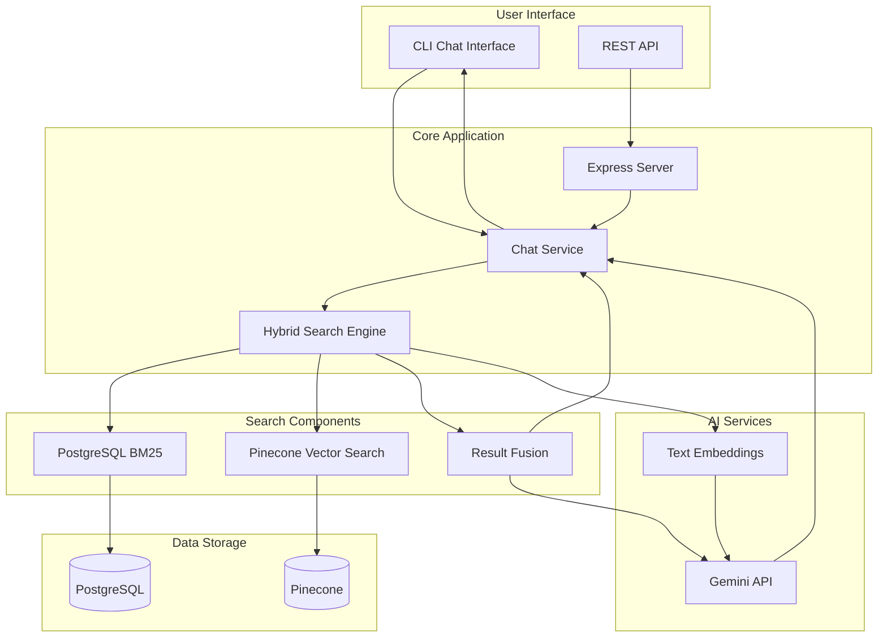

# Stripe Customer Support Agent - Backend

A comprehensive Node.js backend for the Stripe Customer Support Agent featuring AI-powered chat capabilities, hybrid search (BM25 + semantic), and documentation ingestion using PineCone and PostgreSQL.

## 🚀 Features

### Core Capabilities

- **🤖 AI-Powered Chat**: Interactive chat interface with Stripe documentation using Gemini 2.0-flash
- **🔍 Hybrid Search**: Combines PostgreSQL BM25 keyword search with Pinecone semantic search
- **📚 Scraping and Ingestion**: Web scraping and ingestion of Stripe documentation
- **🗄️ PostgreSQL & PineCone Integration**: Scalable document storage with hybrid search capabilities
- **🔗 Vector Embeddings**: Semantic search using Google's text-embedding-004 model
- **📊 Advanced Chunking**: Intelligent document chunking with code detection
- **🎯 Weighted Fusion**: Combines BM25 and semantic search results for optimal relevance

### Technical Features

- **REST API**: Support ticket management endpoints
- **Error Handling**: Comprehensive error handling and logging
- **Rate Limiting**: Built-in rate limiting for API calls
- **Database Migration**: Automated migration from JSON to PostgreSQL
- **Testing Suite**: Comprehensive test coverage

## 🏗️ System Architecture

The Stripe Customer Support Agent uses a hybrid search approach combining keyword and semantic search to provide accurate, context-aware responses.

### Architecture Overview



### How It Works

1. **User Query**: User asks a question via CLI or API
2. **Hybrid Search**: System searches both PostgreSQL (keyword) and Pinecone (semantic)
3. **Result Fusion**: Combines and ranks results from both search methods
4. **AI Response**: Gemini generates a contextual response with source citations
5. **User Answer**: Final answer delivered with references to Stripe documentation

### Key Components

- **Chat Service**: Handles user interactions and AI responses
- **Hybrid Search**: Combines BM25 keyword search with vector semantic search
- **PostgreSQL**: Stores document chunks with full-text search capabilities
- **Pinecone**: Vector database for semantic similarity search
- **Gemini API**: Powers AI responses and text embeddings

## 📁 Project Structure

```
Backend/
├── config/
│   ├── config.js              # Configuration management
│   └── database.js             # PostgreSQL connection
├── controllers/                # API route controllers
├── middleware/
│   └── errorHandler.js         # Error handling middleware
├── routes/                     # API route definitions
├── services/
│   ├── documentStorageService.js    # Document storage operations
│   └── postgresBM25Service.js       # PostgreSQL BM25 search
├── scripts/
│   ├── chat.js                # AI-powered chat interface
│   ├── scraper.js              # Web scraper for Stripe docs
│   ├── ingest.js               # Document ingestion pipeline
│   ├── migrate-to-postgres.js  # Database migration script
│   ├── setup_database.sql      # Database schema
│   └── setup_raw_documents.sql # Raw documents schema
├── tests/                      # Test suite
│   ├── testChatIntegration.js
│   ├── testHybridSearch.js
│   ├── testPostgreSQL.js
│   └── testDocumentLoading.js
├── utils/
│   ├── advancedChunker.js      # Intelligent document chunking
│   └── codeDetector.js         # Code detection utilities
├── hybridSearch.js            # Hybrid search implementation
├── index.js                   # Main server file
├── package.json               # Dependencies and scripts
└── README.md                  # This file
```

## 🚀 Quick Start

### 1. Installation

```bash
# Clone the repository
git clone <repository-url>
cd Backend

# Install dependencies
npm install
```

### 2. Environment Configuration

```bash
# Copy environment template
cp env.example .env

# Edit .env with your configuration
```

### 3. Required Environment Variables

```env
# Gemini Configuration (Required)
GEMINI_API_KEY=your_gemini_api_key_here

# PostgreSQL Configuration
DB_HOST=localhost
DB_PORT=5432
DB_NAME=stripe_support
DB_USER=your_username
DB_PASSWORD=your_password

# Pinecone Configuration
PINECONE_API_KEY=your_pinecone_api_key_here
PINECONE_INDEX_NAME=stripe-docs

# Server Configuration
PORT=5000
HOST=localhost

# Processing Configuration
CHUNK_SIZE=800
CHUNK_OVERLAP=100
MAX_CHUNKS=10
BATCH_SIZE=5
```

### 4. Database Setup

```bash
# Setup PostgreSQL database
npm run migrate:postgres
```

### 5. Data Ingestion

```bash
# Scrape Stripe documentation
npm run scrape

# Ingest documents into database
npm run ingest
```

### 6. Start the Application

```bash
# Start the server
npm start

# Or start chat interface
npm run chat
```

## 🎯 Usage

### Chat Interface

```bash
# Start interactive chat
npm run chat
```

The chat interface provides:

- **Natural Language Queries**: Ask questions about Stripe integration
- **Source Citations**: Get references to official documentation
- **Error Code Resolution**: Specific help for Stripe error codes
- **Context-Aware Responses**: AI understands your specific use case

## 🔧 Services & Components

### Core Services

#### 1. Hybrid Search Engine (`hybridSearch.js`)

- **Purpose**: Combines PostgreSQL BM25 and Pinecone semantic search
- **Features**:
  - Weighted fusion of search results
  - Error code detection and handling
  - Query preprocessing and optimization
  - Result ranking and filtering

#### 2. PostgreSQL BM25 Service (`services/postgresBM25Service.js`)

- **Purpose**: Full-text search using PostgreSQL's built-in BM25
- **Features**:
  - Document chunk storage and retrieval
  - Full-text search with ranking
  - Category-based filtering
  - Statistics and analytics

#### 3. Document Storage Service (`services/documentStorageService.js`)

- **Purpose**: Manages document storage and retrieval
- **Features**:
  - Document metadata management
  - Chunk organization and indexing
  - Storage optimization

#### 4. Advanced Chunker (`utils/advancedChunker.js`)

- **Purpose**: Intelligent document chunking with code detection
- **Features**:
  - Code-aware chunking
  - Context preservation
  - Optimal chunk size management

### API Endpoints

#### Server Endpoints

```bash
# Server status and health check
GET /
Response: { message: "Stripe Support API is running!" }

# Get all support tickets
GET /api/tickets
Response: { tickets: [...] }

# Create a new support ticket
POST /api/tickets
Body: { title: string, description: string }
Response: { message: "Ticket created!", ticket: {...} }
```

#### Chat Endpoints (via CLI)

```bash
# Interactive chat interface
npm run chat

# Chat features:
- Natural language processing
- Context-aware responses
- Source citation
- Error code resolution
```

### Scripts & Utilities

#### Data Processing Scripts

```bash
# Web scraping
npm run scrape
# - Scrapes Stripe documentation
# - Saves to local file storage
# - Handles rate limiting

# Document ingestion
npm run ingest
# - Processes scraped documents
# - Creates vector embeddings
# - Stores in PostgreSQL and Pinecone

# Database migration
npm run migrate:postgres
# - Migrates from JSON to PostgreSQL
# - Sets up database schema
# - Transfers existing data
```

#### Testing Scripts

```bash
# Comprehensive testing
npm test

# Individual test suites
npm run test:documents    # Document loading and processing
npm run test:hybrid       # Hybrid search functionality
npm run test:chat         # Chat integration
npm run test:postgres     # PostgreSQL operations
```

### Configuration Management

#### Environment Variables

```env
# AI Configuration
GEMINI_API_KEY=your_gemini_api_key_here

# Database Configuration
DB_HOST=localhost
DB_PORT=5432
DB_NAME=stripe_support
DB_USER=your_username
DB_PASSWORD=your_password

# Vector Database
PINECONE_API_KEY=your_pinecone_api_key_here
PINECONE_INDEX_NAME=stripe-docs

# Processing Configuration
CHUNK_SIZE=800
CHUNK_OVERLAP=100
MAX_CHUNKS=10
BATCH_SIZE=5
```

#### Database Schema

```sql
-- Document chunks table
CREATE TABLE document_chunks (
    chunk_id VARCHAR PRIMARY KEY,
    content TEXT NOT NULL,
    metadata JSONB,
    title VARCHAR,
    category VARCHAR,
    source VARCHAR,
    word_count INTEGER,
    created_at TIMESTAMP DEFAULT NOW(),
    updated_at TIMESTAMP DEFAULT NOW()
);

-- Full-text search index
CREATE INDEX idx_document_chunks_content
ON document_chunks USING gin(to_tsvector('english', content));
```

## 🧪 Testing

```bash
# Run all tests
npm test

# Individual test suites
npm run test:documents    # Document loading tests
npm run test:hybrid       # Hybrid search tests
npm run test:chat         # Chat integration tests
npm run test:postgres     # PostgreSQL tests
```

## 🔧 Development

### Available Scripts

```bash
npm start              # Start the server
npm run scrape         # Scrape Stripe documentation
npm run ingest         # Ingest documents into database
npm run chat           # Start chat interface
npm run migrate:postgres # Migrate to PostgreSQL
npm run setup          # Full setup (scrape + ingest)
npm run dev            # Development mode
npm test               # Run test suite
```

### Development Workflow

1. **Setup**: `npm run setup` - Complete environment setup
2. **Development**: `npm run dev` - Start development mode
3. **Testing**: `npm test` - Run comprehensive tests
4. **Chat**: `npm run chat` - Test chat functionality

## 🔑 API Keys Setup

### Gemini API Key

1. Visit [Google AI Studio](https://aistudio.google.com/welcome)
2. Sign in with your Google account
3. Click "Get API Key" and create a new key
4. Add to your `.env` file

### Pinecone API Key

1. Visit [Pinecone Console](https://app.pinecone.io/)
2. Create a new project
3. Generate an API key
4. Add to your `.env` file

## 🚀 Deployment

### Production Setup

#### 1. Environment Configuration

```bash
# Production environment variables
NODE_ENV=production
PORT=5000
HOST=0.0.0.0

# Database Configuration
DB_HOST=your_postgres_host
DB_PORT=5432
DB_NAME=stripe_support_prod
DB_USER=your_prod_username
DB_PASSWORD=your_secure_password

# AI Configuration
GEMINI_API_KEY=your_production_gemini_key

# Vector Database
PINECONE_API_KEY=your_production_pinecone_key
PINECONE_INDEX_NAME=stripe-docs-prod

# Security
JWT_SECRET=your_secure_jwt_secret
```

#### 2. Database Setup

```bash
# Create production database
createdb stripe_support_prod

# Run migrations
npm run migrate:postgres

# Setup indexes for performance
psql -d stripe_support_prod -f scripts/setup_database.sql
```

#### 3. Data Ingestion

```bash
# Scrape and ingest documentation
npm run scrape
npm run ingest

# Verify data ingestion
npm run test:postgres
```

#### 4. Application Deployment

```bash
# Install production dependencies
npm ci --only=production

# Start the application
npm start
```

### Docker Deployment

#### Dockerfile

```dockerfile
FROM node:18-alpine

# Set working directory
WORKDIR /app

# Copy package files
COPY package*.json ./

# Install dependencies
RUN npm ci --only=production

# Copy application code
COPY . .

# Create non-root user
RUN addgroup -g 1001 -S nodejs
RUN adduser -S nodejs -u 1001

# Change ownership
RUN chown -R nodejs:nodejs /app
USER nodejs

# Expose port
EXPOSE 5000

# Health check
HEALTHCHECK --interval=30s --timeout=3s --start-period=5s --retries=3 \
  CMD curl -f http://localhost:5000/ || exit 1

# Start application
CMD ["npm", "start"]
```

#### Docker Compose

```yaml
version: "3.8"

services:
  app:
    build: .
    ports:
      - "5000:5000"
    environment:
      - NODE_ENV=production
      - DB_HOST=postgres
      - DB_PORT=5432
      - DB_NAME=stripe_support
      - DB_USER=stripe_user
      - DB_PASSWORD=stripe_password
    depends_on:
      - postgres
    volumes:
      - ./data:/app/data

  postgres:
    image: postgres:15-alpine
    environment:
      - POSTGRES_DB=stripe_support
      - POSTGRES_USER=stripe_user
      - POSTGRES_PASSWORD=stripe_password
    volumes:
      - postgres_data:/var/lib/postgresql/data
      - ./scripts/setup_database.sql:/docker-entrypoint-initdb.d/setup.sql

volumes:
  postgres_data:
```

### Cloud Deployment

#### AWS Deployment

```bash
# Using AWS CLI
aws ec2 run-instances \
  --image-id ami-0c02fb55956c7d316 \
  --instance-type t3.medium \
  --key-name your-key-pair \
  --security-groups your-security-group \
  --user-data file://user-data.sh
```

#### Heroku Deployment

```bash
# Create Heroku app
heroku create stripe-support-agent

# Set environment variables
heroku config:set GEMINI_API_KEY=your_key
heroku config:set PINECONE_API_KEY=your_key
heroku config:set DB_HOST=your_db_host

# Deploy
git push heroku main
```

#### Render Deployment

```yaml
# render.yaml
services:
  - type: web
    name: stripe-support-agent
    env: node
    buildCommand: npm install
    startCommand: npm start
    envVars:
      - key: NODE_ENV
        value: production
      - key: GEMINI_API_KEY
        fromDatabase:
          name: stripe-support-db
          property: gemini_api_key
```

### Performance Optimization

#### Database Optimization

```sql
-- Create indexes for better performance
CREATE INDEX CONCURRENTLY idx_document_chunks_category
ON document_chunks(category);

CREATE INDEX CONCURRENTLY idx_document_chunks_source
ON document_chunks(source);

-- Analyze tables for query optimization
ANALYZE document_chunks;
```

#### Application Optimization

```javascript
// Enable compression
app.use(compression());

// Set up caching
app.use(cache("5 minutes"));

// Rate limiting
const rateLimit = require("express-rate-limit");
const limiter = rateLimit({
  windowMs: 15 * 60 * 1000, // 15 minutes
  max: 100, // limit each IP to 100 requests per windowMs
});
app.use(limiter);
```

### Monitoring & Logging

#### Health Checks

```javascript
// Health check endpoint
app.get("/health", async (req, res) => {
  try {
    // Check database connection
    await pool.query("SELECT 1");

    // Check Pinecone connection
    await pinecone.describeIndexStats();

    res.json({
      status: "healthy",
      timestamp: new Date().toISOString(),
      services: {
        database: "connected",
        pinecone: "connected",
        gemini: "configured",
      },
    });
  } catch (error) {
    res.status(503).json({
      status: "unhealthy",
      error: error.message,
    });
  }
});
```

#### Logging Configuration

```javascript
// Winston logging setup
const winston = require("winston");

const logger = winston.createLogger({
  level: "info",
  format: winston.format.combine(
    winston.format.timestamp(),
    winston.format.errors({ stack: true }),
    winston.format.json()
  ),
  transports: [
    new winston.transports.File({ filename: "error.log", level: "error" }),
    new winston.transports.File({ filename: "combined.log" }),
    new winston.transports.Console({
      format: winston.format.simple(),
    }),
  ],
});
```

### Security Considerations

#### Environment Security

```bash
# Use environment-specific configs
cp env.example .env.production

# Secure API keys
export GEMINI_API_KEY="$(vault kv get -field=api_key secret/gemini)"
export PINECONE_API_KEY="$(vault kv get -field=api_key secret/pinecone)"
```

#### Database Security

```sql
-- Create restricted user
CREATE USER stripe_app WITH PASSWORD 'secure_password';
GRANT SELECT, INSERT, UPDATE ON document_chunks TO stripe_app;
GRANT USAGE ON SEQUENCE document_chunks_id_seq TO stripe_app;
```

### Backup & Recovery

#### Database Backup

```bash
# Create backup
pg_dump -h localhost -U stripe_user stripe_support > backup_$(date +%Y%m%d).sql

# Restore from backup
psql -h localhost -U stripe_user stripe_support < backup_20231201.sql
```

#### Automated Backups

```bash
#!/bin/bash
# backup.sh
DATE=$(date +%Y%m%d_%H%M%S)
pg_dump -h $DB_HOST -U $DB_USER $DB_NAME > "backup_$DATE.sql"
aws s3 cp "backup_$DATE.sql" s3://your-backup-bucket/
```

## 📊 Performance

- **Hybrid Search**: Combines BM25 and semantic search for optimal results
- **Intelligent Chunking**: Advanced chunking with code detection
- **Rate Limiting**: Built-in rate limiting for API stability
- **Caching**: Efficient caching of search results
- **Scalability**: PostgreSQL-based storage for large document collections

## 🤝 Contributing

1. Fork the repository
2. Create a feature branch
3. Make your changes
4. Run tests: `npm test`
5. Submit a pull request

## 📄 License

This project is licensed under the ISC License.
