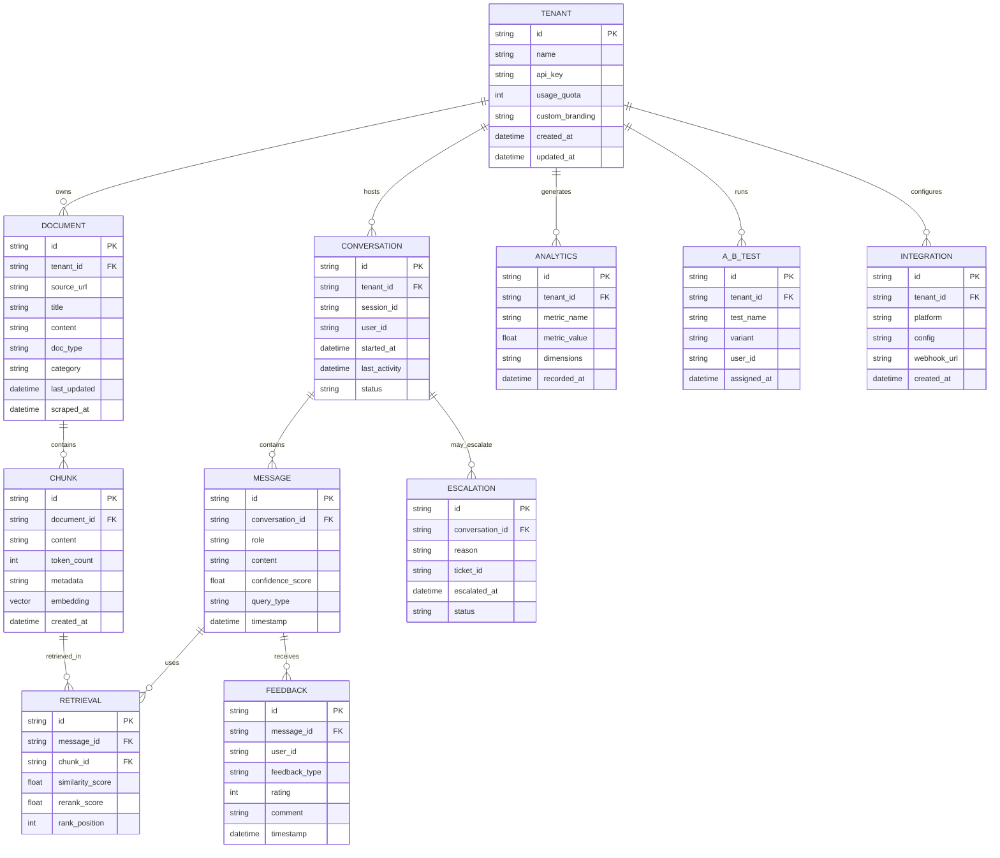

# 🗄️ Stripe Customer Support Agent - Data Model & ER Diagram

## 📋 Overview

This document defines the complete data model for the Stripe Customer Support Agent system, including Entity-Relationship diagrams, entity descriptions, and database schema specifications.

---

## 🎯 **Entity-Relationship Diagram**



---

## 📊 **Entity Descriptions**

### **Core Entities**

#### **TENANT**

- **Purpose**: Represents different companies/organizations using the system
- **Key Features**: Multi-tenancy support with isolated data and configurations
- **Attributes**:
  - `id`: Unique tenant identifier
  - `name`: Tenant company name
  - `api_key`: API key for tenant authentication
  - `usage_quota`: Monthly usage limit
  - `custom_branding`: Tenant-specific UI customization
  - `created_at`: Tenant creation timestamp
  - `updated_at`: Last modification timestamp

#### **DOCUMENT**

- **Purpose**: Stores scraped documentation from various sources
- **Key Features**: Links to tenant for multi-tenant isolation
- **Attributes**:
  - `id`: Unique document identifier
  - `tenant_id`: Foreign key to TENANT
  - `source_url`: Original document URL
  - `title`: Document title
  - `content`: Full document content
  - `doc_type`: Type (api/guide/support)
  - `category`: Category (billing/webhooks/payments)
  - `last_updated`: Last update timestamp
  - `scraped_at`: Scraping timestamp

#### **CHUNK**

- **Purpose**: Text chunks created from documents for vector search
- **Key Features**: Contains embeddings for semantic search
- **Attributes**:
  - `id`: Unique chunk identifier
  - `document_id`: Foreign key to DOCUMENT
  - `content`: Chunk text content
  - `token_count`: Number of tokens in chunk
  - `metadata`: JSON metadata (source, type, etc.)
  - `embedding`: Vector embedding (1536 dimensions)
  - `created_at`: Chunk creation timestamp

#### **CONVERSATION**

- **Purpose**: Represents a chat session between user and AI
- **Key Features**: Tracks session state and user context
- **Attributes**:
  - `id`: Unique conversation identifier
  - `tenant_id`: Foreign key to TENANT
  - `session_id`: Session identifier for tracking
  - `user_id`: User identifier
  - `started_at`: Conversation start timestamp
  - `last_activity`: Last activity timestamp
  - `status`: Conversation status (active/closed/escalated)

#### **MESSAGE**

- **Purpose**: Individual messages within a conversation
- **Key Features**: Stores both user queries and AI responses
- **Attributes**:
  - `id`: Unique message identifier
  - `conversation_id`: Foreign key to CONVERSATION
  - `role`: Message role (user/assistant/system)
  - `content`: Message content
  - `confidence_score`: AI confidence score (0-1)
  - `query_type`: Query classification
  - `timestamp`: Message timestamp

### **Analytics & Feedback Entities**

#### **RETRIEVAL**

- **Purpose**: Tracks which chunks were retrieved for each message
- **Key Features**: Enables retrieval quality analysis
- **Attributes**:
  - `id`: Unique retrieval identifier
  - `message_id`: Foreign key to MESSAGE
  - `chunk_id`: Foreign key to CHUNK
  - `similarity_score`: Semantic similarity score
  - `rerank_score`: Cross-encoder re-ranking score
  - `rank_position`: Position in ranked results

#### **FEEDBACK**

- **Purpose**: User feedback on AI responses
- **Key Features**: Enables continuous improvement
- **Attributes**:
  - `id`: Unique feedback identifier
  - `message_id`: Foreign key to MESSAGE
  - `user_id`: User providing feedback
  - `feedback_type`: Type (thumbs_up/thumbs_down/comment)
  - `rating`: Numerical rating (1-5)
  - `comment`: Optional text feedback
  - `timestamp`: Feedback timestamp

#### **ANALYTICS**

- **Purpose**: Aggregated metrics for dashboards
- **Key Features**: Tracks performance, usage, and satisfaction
- **Attributes**:
  - `id`: Unique analytics identifier
  - `tenant_id`: Foreign key to TENANT
  - `metric_name`: Metric name (response_time, satisfaction, etc.)
  - `metric_value`: Metric value
  - `dimensions`: JSON dimensions (category, user_type, etc.)
  - `recorded_at`: Recording timestamp

### **Advanced Features Entities**

#### **A_B_TEST**

- **Purpose**: Tracks A/B testing assignments
- **Key Features**: Links users to test variants
- **Attributes**:
  - `id`: Unique test identifier
  - `tenant_id`: Foreign key to TENANT
  - `test_name`: Test name (chunking, retrieval, prompts)
  - `variant`: Test variant (A/B/C)
  - `user_id`: User in test
  - `assigned_at`: Assignment timestamp

#### **ESCALATION**

- **Purpose**: Records when conversations are escalated to humans
- **Key Features**: Tracks escalation reasons and ticket creation
- **Attributes**:
  - `id`: Unique escalation identifier
  - `conversation_id`: Foreign key to CONVERSATION
  - `reason`: Escalation reason (low_confidence, user_frustration, etc.)
  - `ticket_id`: External ticket system ID
  - `escalated_at`: Escalation timestamp
  - `status`: Escalation status (pending/resolved/closed)

#### **INTEGRATION**

- **Purpose**: Configuration for external platform integrations
- **Key Features**: Supports Slack, Discord, and webhook integrations
- **Attributes**:
  - `id`: Unique integration identifier
  - `tenant_id`: Foreign key to TENANT
  - `platform`: Integration platform (slack/discord/webhook)
  - `config`: JSON configuration
  - `webhook_url`: Webhook endpoint URL
  - `created_at`: Integration creation timestamp

---

## 🗃️ **Database Schema Specifications**

### **MongoDB Collections (Primary Database)**

#### **conversations**

```javascript
{
  _id: ObjectId,
  tenantId: String,
  sessionId: String,
  userId: String,
  startedAt: Date,
  lastActivity: Date,
  status: String, // 'active', 'closed', 'escalated'
  messages: [{
    id: String,
    role: String, // 'user', 'assistant', 'system'
    content: String,
    confidenceScore: Number,
    queryType: String,
    timestamp: Date,
    retrievals: [{
      chunkId: String,
      similarityScore: Number,
      rerankScore: Number,
      rankPosition: Number
    }],
    feedback: {
      type: String, // 'thumbs_up', 'thumbs_down', 'comment'
      rating: Number,
      comment: String,
      timestamp: Date
    }
  }]
}
```

#### **documents**

```javascript
{
  _id: ObjectId,
  tenantId: String,
  sourceUrl: String,
  title: String,
  content: String,
  docType: String, // 'api', 'guide', 'support'
  category: String, // 'billing', 'webhooks', 'payments'
  lastUpdated: Date,
  scrapedAt: Date,
  chunks: [{
    id: String,
    content: String,
    tokenCount: Number,
    metadata: Object,
    embedding: [Number], // 1536 dimensions
    createdAt: Date
  }]
}
```

### **PostgreSQL Tables (Analytics Database)**

#### **tenants**

```sql
CREATE TABLE tenants (
    id VARCHAR(36) PRIMARY KEY,
    name VARCHAR(255) NOT NULL,
    api_key VARCHAR(255) UNIQUE NOT NULL,
    usage_quota INTEGER DEFAULT 10000,
    custom_branding JSONB,
    created_at TIMESTAMP DEFAULT CURRENT_TIMESTAMP,
    updated_at TIMESTAMP DEFAULT CURRENT_TIMESTAMP
);
```

#### **analytics**

```sql
CREATE TABLE analytics (
    id VARCHAR(36) PRIMARY KEY,
    tenant_id VARCHAR(36) REFERENCES tenants(id),
    metric_name VARCHAR(100) NOT NULL,
    metric_value DECIMAL(10,4) NOT NULL,
    dimensions JSONB,
    recorded_at TIMESTAMP DEFAULT CURRENT_TIMESTAMP
);
```

#### **a_b_tests**

```sql
CREATE TABLE a_b_tests (
    id VARCHAR(36) PRIMARY KEY,
    tenant_id VARCHAR(36) REFERENCES tenants(id),
    test_name VARCHAR(100) NOT NULL,
    variant VARCHAR(10) NOT NULL,
    user_id VARCHAR(36) NOT NULL,
    assigned_at TIMESTAMP DEFAULT CURRENT_TIMESTAMP
);
```

#### **escalations**

```sql
CREATE TABLE escalations (
    id VARCHAR(36) PRIMARY KEY,
    conversation_id VARCHAR(36) NOT NULL,
    reason VARCHAR(100) NOT NULL,
    ticket_id VARCHAR(100),
    escalated_at TIMESTAMP DEFAULT CURRENT_TIMESTAMP,
    status VARCHAR(20) DEFAULT 'pending'
);
```

#### **integrations**

```sql
CREATE TABLE integrations (
    id VARCHAR(36) PRIMARY KEY,
    tenant_id VARCHAR(36) REFERENCES tenants(id),
    platform VARCHAR(50) NOT NULL,
    config JSONB NOT NULL,
    webhook_url VARCHAR(500),
    created_at TIMESTAMP DEFAULT CURRENT_TIMESTAMP
);
```

### **Pinecone Vector Database**

#### **Vector Index Configuration**

```javascript
{
  name: "stripe-docs",
  dimension: 1536,
  metric: "cosine",
  pods: 1,
  replicas: 1,
  pod_type: "p1.x1",
  metadata_config: {
    indexed: ["source_url", "doc_type", "category", "tenant_id"]
  }
}
```

#### **Vector Metadata Schema**

```javascript
{
  id: String, // Chunk ID
  values: [Number], // 1536-dimensional embedding
  metadata: {
    tenant_id: String,
    document_id: String,
    source_url: String,
    doc_type: String,
    category: String,
    token_count: Number,
    created_at: String
  }
}
```

---

## 🔗 **Relationship Specifications**

### **One-to-Many Relationships**

1. **TENANT → DOCUMENT**: One tenant owns many documents

   - **Cascade**: DELETE CASCADE (delete tenant deletes all documents)
   - **Index**: `tenant_id` indexed for fast queries

2. **DOCUMENT → CHUNK**: One document contains many chunks

   - **Cascade**: DELETE CASCADE (delete document deletes all chunks)
   - **Index**: `document_id` indexed for fast queries

3. **TENANT → CONVERSATION**: One tenant hosts many conversations

   - **Cascade**: DELETE CASCADE (delete tenant deletes all conversations)
   - **Index**: `tenant_id` indexed for fast queries

4. **CONVERSATION → MESSAGE**: One conversation contains many messages

   - **Cascade**: DELETE CASCADE (delete conversation deletes all messages)
   - **Index**: `conversation_id` indexed for fast queries

5. **MESSAGE → RETRIEVAL**: One message uses many retrievals

   - **Cascade**: DELETE CASCADE (delete message deletes all retrievals)
   - **Index**: `message_id` indexed for fast queries

6. **CHUNK → RETRIEVAL**: One chunk can be retrieved in many messages
   - **Cascade**: DELETE CASCADE (delete chunk deletes all retrievals)
   - **Index**: `chunk_id` indexed for fast queries

### **Many-to-Many Relationships**

1. **MESSAGE ↔ CHUNK** (via RETRIEVAL): Many-to-many through retrieval table
2. **TENANT ↔ INTEGRATION**: One tenant can have many integrations
3. **TENANT ↔ A_B_TEST**: One tenant can run many A/B tests

---

## 📊 **Indexing Strategy**

### **MongoDB Indexes**

```javascript
// conversations collection
db.conversations.createIndex({ tenantId: 1, sessionId: 1 });
db.conversations.createIndex({ tenantId: 1, lastActivity: -1 });
db.conversations.createIndex({ status: 1, lastActivity: -1 });

// documents collection
db.documents.createIndex({ tenantId: 1, docType: 1 });
db.documents.createIndex({ tenantId: 1, category: 1 });
db.documents.createIndex({ scrapedAt: -1 });
```

### **PostgreSQL Indexes**

```sql
-- analytics table
CREATE INDEX idx_analytics_tenant_metric ON analytics(tenant_id, metric_name);
CREATE INDEX idx_analytics_recorded_at ON analytics(recorded_at);

-- a_b_tests table
CREATE INDEX idx_ab_tests_tenant_test ON a_b_tests(tenant_id, test_name);
CREATE INDEX idx_ab_tests_user ON a_b_tests(user_id);

-- escalations table
CREATE INDEX idx_escalations_conversation ON escalations(conversation_id);
CREATE INDEX idx_escalations_status ON escalations(status);
```

---

## 🔒 **Data Security & Privacy**

### **Data Encryption**

- **At Rest**: AES-256 encryption for sensitive data
- **In Transit**: TLS 1.3 for all API communications
- **PII Detection**: Automatic detection and masking of sensitive information

### **Access Control**

- **Tenant Isolation**: Strict data isolation between tenants
- **API Authentication**: JWT tokens with tenant-specific claims
- **Role-Based Access**: Admin, Support Agent, Developer roles

### **Data Retention**

- **Conversations**: 90 days for active, 1 year for closed
- **Analytics**: 2 years for aggregated data
- **Feedback**: 1 year for improvement analysis
- **A/B Tests**: 6 months after test completion

---

## 📈 **Performance Considerations**

### **Query Optimization**

- **Vector Search**: Optimized for <100ms response time
- **Analytics Queries**: Materialized views for common aggregations
- **Conversation History**: Pagination for large conversations

### **Caching Strategy**

- **Redis Cache**: Frequently accessed chunks and embeddings
- **CDN**: Static assets and documentation
- **Application Cache**: User sessions and preferences

### **Scaling Considerations**

- **Horizontal Scaling**: Multiple application instances
- **Database Sharding**: Tenant-based sharding strategy
- **Vector Database**: Pinecone auto-scaling configuration

This comprehensive data model supports the full feature set of the Stripe Customer Support Agent across all tiers, from basic RAG functionality to enterprise-grade multi-tenant systems.
